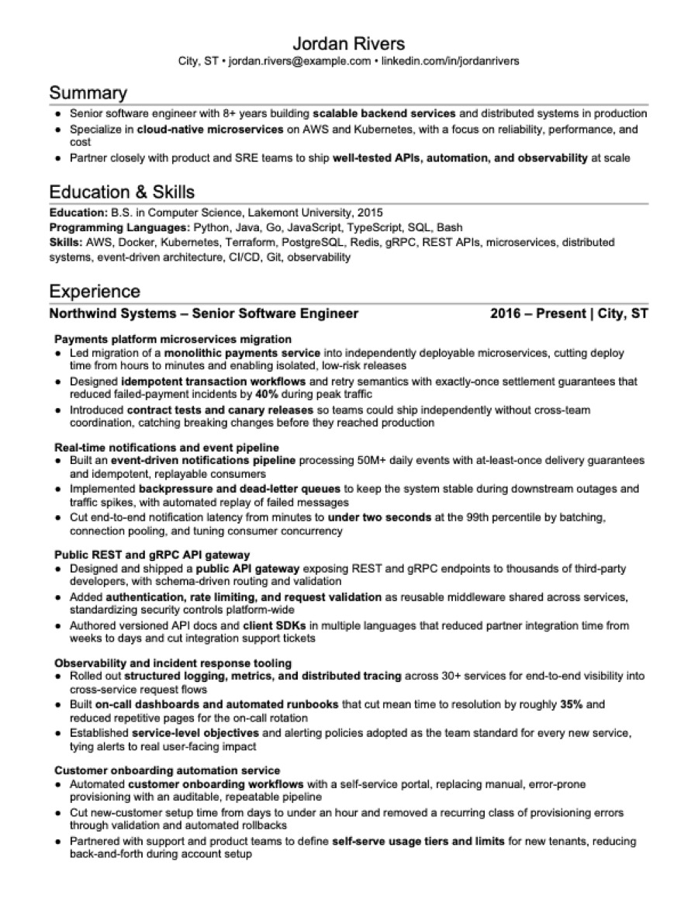
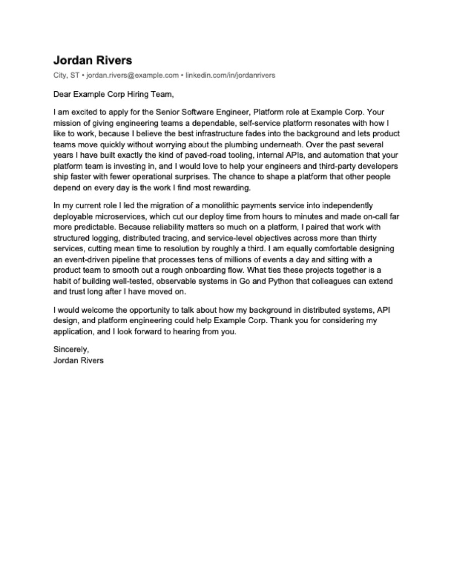

# Jobs Finder — AI job hunting without invented experience

AI should tailor your resume—not invent your career or force it into someone
else's template. Jobs Finder starts from experience and skill rules you approve,
preserves your own Word format, and rejects output that changes locked facts or
breaks the one-page layout.

Point Claude Code, Cursor, Codex, or another AI coding agent at this repo to find
matching roles, create validated resumes and a researched cover letter for every
posting, track your application pipeline, and prepare for interviews—all in a
local, reproducible workflow you can inspect and control.

## What makes it different

Many tools can write a resume, score it against a JD, or track applications. This
toolkit treats the whole job hunt as a **local, reproducible build** with safeguards
that the surveyed commercial and open-source alternatives do not publicly document
together:

| Differentiator                         | What it means in practice                                                                                                                                                                                                                                                                    |
| -------------------------------------- | -------------------------------------------------------------------------------------------------------------------------------------------------------------------------------------------------------------------------------------------------------------------------------------------- |
| **Truthfulness is a build gate**       | Tailoring starts from your approved baseline resume. Locked identity/employment fields and real project titles are machine-checked. Skills follow explicit consequences: Never means never include, Weak or Selective means include only when the JD specifically mentions it, and Approved means include in most resumes, if not all. Unknown skills fail validation instead of being silently added. |
| **Your DOCX is the template**          | The renderer fills your own approved Word document, preserving its fonts, margins, spacing, and styles, then rejects a PDF that is not one page, is broken, or leaves too much blank space.                                                                                                  |
| **Every application is reproducible**  | The saved JD, structured resume source, exact DOCX/PDF, metadata, and copy-paste answers stay together. Related roles can share one honest resume, but every JD still gets its own researched letter and packet.                                                                             |
| **One workspace covers the full hunt** | Multi-source, sponsorship/location-aware discovery feeds tailoring, a folder-backed application pipeline, deep company/role research, and reusable behavioral interview stories.                                                                                                             |
| **Privacy is architectural**           | Real data can live in a separate private overlay. A blocking leak guard checks paths, text, structural PII, identity tokens, and extractable DOCX/PDF content before the public toolkit can ship.                                                                                            |

See the [feature inventory, competitor matrix, implementation deep dives, limitations,
and sources](docs/comparisons/resume-writing-tools.md). The comparison was researched
on 2026-07-20; “not publicly documented” is evidence of differentiation, not a claim
that another product could never implement the capability.

Here is what one tailoring run produces — a resume rendered into *your* approved
DOCX format, plus an individually researched cover letter per posting:

| Tailored resume (PDF) | Cover letter (PDF, one per posting) |
|---|---|
|  |  |

Every application also gets a bundled, copy-paste `..._Application_<role>.txt`
(cover letter + "why this company/role" + "past experience" sections for portal
text boxes) and a `meta.yaml` of structured facts (level, required YOE, salary,
sponsorship). The full worked example lives in
[`examples/applications/6_drafted/example-corp-senior-software-engineer/`](examples/applications/6_drafted/example-corp-senior-software-engineer/).

## Try it in three commands

Works out of the box on a fresh clone — no config needed; every tool falls back to
the fictional "Jordan Rivers" example candidate. Requires Python 3.11+
(`python3 --version` first) and, for PDF output, LibreOffice
(`brew install --cask libreoffice`; or add `--no-pdf` to skip).

```bash
git clone https://github.com/<owner>/jobs-finder-toolkit.git && cd jobs-finder-toolkit   # or your fork
python3 -m venv .venv && .venv/bin/pip install -r requirements.txt
.venv/bin/python .agents/skills/resume-writer/scripts/render.py examples/applications/6_drafted/example-corp-senior-software-engineer/
```

That renders and validates the example resume + cover letter you see above. Then
open the repo in your AI agent and just talk to it — the skills route themselves.

## The workflow

The toolkit turns one **candidate profile** into tailored applications and tracks
them. One-time setup, then five steps, each driven by a prompt to your agent:

```
0. Setup ............ config.yaml + profile + baseline resume YAML + reference DOCX   (one time)
1. Profile & filters  define WHO you are and WHAT you want    → job-search profile
2. Search ........... find fresh, sponsorship-aware postings  → job-search skill
3. Generate ......... tailor resume + cover letters per JD    → resume-writer skill
4. Review & track ... you decide; move the folder             → application-tracker
5. Interview prep ... company research + behavioral stories   → company-research /
                                                                behavioral-interview-prep
```

> "Find senior backend roles posted this week that sponsor H-1B"
> "Tailor my resume for this job: [paste JD]"
> "Research Example Corp for my interview and build a question bank"

Applications land in `6_drafted/` for your review; **the folder is the status** —
move it to `5_applied/`, `4_in_progress/`, `3_rejected/`, or `2_ignored/` as things
progress (or ask the agent; the number prefix is a fixed sort key, not a sequence). `status.py` prints the pipeline any time:

```bash
.venv/bin/python .agents/skills/application-tracker/scripts/status.py
```

New here? Ask your agent anything — the `ask-me-anything` skill is the built-in
tour guide for the whole toolkit.

## Use your own data

Your real identity never enters this repo. Copy the example config and point its
`paths.*` at your own files — `config.yaml` is git-ignored:

```bash
cp config.example.yaml config.yaml     # edit: your name, your file paths
python scripts/bootstrap_overlay.py    # wires git hooks (+ overlay symlinks if mounted)
```

Keep your real profile, applications, and interview prep in a **private overlay** —
your own git repo mounted at the git-ignored `private/` directory. A leak guard
(run blocking in CI and in the pre-push hook) screens every tracked file for your
identity so nothing personal can ship by accident. Full walkthrough, including
creating an overlay from scratch: [docs/PRIVATE_OVERLAY.md](docs/PRIVATE_OVERLAY.md).

## The skills

Skills live in [`.agents/skills/`](.agents/skills/) — self-contained (each bundles
its scripts and vendored dependencies), agent-agnostic, and also published as a
Claude Code plugin marketplace via
[`.claude-plugin/marketplace.json`](.claude-plugin/marketplace.json):

- `ask-me-anything` — orientation guide: the five-step workflow and what each step needs (start here)
- `job-search` — discover and rank fresh postings by role, location, recency, and visa sponsorship
- `resume-writer` — tailor resumes for ATS fit and render validated DOCX + PDF + cover letters
- `application-tracker` — pipeline status, structured `meta.yaml` facts, notes, skip-logs
- `behavioral-interview-prep` — project-based STAR story banks and reusable answers
- `company-research` — deep company + role research and an interview question bank
- `gardener` — periodic memory hygiene for the toolkit's agent-memory zones (dry-run by default)

## Repo layout

```
config.example.yaml      # tracked "Jordan Rivers" placeholder (+ no-config fallback)
examples/                # fictional example: profile, templates, a worked application
.agents/skills/<skill>/  # the skills: SKILL.md + self-contained scripts
scripts/                 # shared modules, vendoring, maintenance, metrics, leak guard
evals/                   # per-skill canary evals (gate skill-instruction changes)
hooks/                   # tracked git hooks (drift check, compile, leak guard)
docs/                    # design docs: ARCHITECTURE, PRIVATE_OVERLAY, METRICS
AGENTS.md                # the agent-facing contract (guardrails + conventions)
```

## Learn more

- [docs/ARCHITECTURE.md](docs/ARCHITECTURE.md) — how it works: the render pipeline,
  config system, application-folder model, vendoring, CI gates, and the full repo
  reference table
- [docs/PRIVATE_OVERLAY.md](docs/PRIVATE_OVERLAY.md) — the public/private two-repo
  model and overlay setup
- [docs/comparisons/resume-writing-tools.md](docs/comparisons/resume-writing-tools.md)
  — detailed feature inventory, market comparison, implementation deep dives, and
  official sources
- [AGENTS.md](AGENTS.md) — the contract AI agents follow (no fabrication,
  validation is mandatory, folder conventions)
- [CONTRIBUTING.md](CONTRIBUTING.md) — dev setup, the check suite, and the PR
  workflow ([CI](.github/workflows/ci.yml) runs it all, including a blocking
  privacy leak guard)

**License:** Apache-2.0. The example candidate ("Jordan Rivers") and all
`examples/` data are fictional.