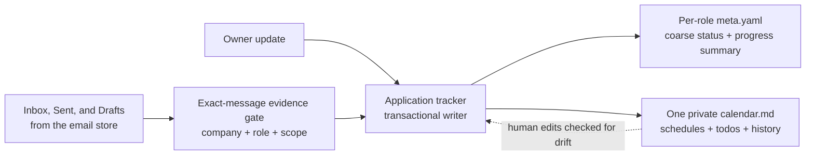

# Application progress, interview scheduling, and the calendar todo file

**Status:** implemented on 2026-07-22. The owner-review correction to the
human calendar and expanded transition coverage is recorded in
[the calendar UX revision](ux-revision.md). This original design remains the
record of the data-ownership and safety decisions; the ordered delivery plan
is in [execution-plan.md](execution-plan.md).

## For the human reviewer

The application tracker currently knows only whether a role is drafted,
applied, in progress, rejected, or ignored. Its free-text `stage` can say
"onsite", but it cannot reliably distinguish "book a time", "I submitted
availability and am waiting", "the interview is confirmed", or "the old
time is being rescheduled". Email reconciliation therefore has nowhere
structured to put the scheduling facts it already sees.

This design adds two small, complementary surfaces:

- Each role gets a normalized progress summary in `meta.yaml`, so the
  pipeline can be filtered and measured without interpreting prose.
- `config.calendar_path()` resolves one private `calendar.md`, so every
  schedule, follow-up deadline, and owner todo is visible in one human
  planning file rather than scattered across application folders.

Email remains evidence, not authority. A message may propose a progress
change, but the existing exact-message and unambiguous-application gates
still decide whether the tracker and calendar may be updated.



Same picture, plain text:

```
Inbox / Sent / Drafts ──▶ exact-message evidence gate ──┐
                                                        ▼
Owner update ─────────────────────────────────────▶ tracker writer
                                                        │
                                ┌───────────────────────┴──────────────────────┐
                                ▼                                              ▼
                     per-role meta.yaml                              one calendar.md
                     status + progress                              schedules + todos
                                                                        │
                                        checked human edits ────────────┘
```

*Takeaway: the tracker is the only writer that changes pipeline progress;
the calendar is the single human schedule view, and email only supplies
evidence through the existing safety gate.*

## 1. Data ownership

Progress and scheduling need one source for each kind of fact; duplicating
the same timestamp in three files would create drift.

| Fact | Canonical home | Why |
| --- | --- | --- |
| Coarse application outcome | `jobs[].status` in `meta.yaml`; status folder remains its derived rollup | Preserves the current pipeline and folder commands |
| Current hiring phase and workflow state | `jobs[].progress` in `meta.yaml` | Small, filterable, one summary per role |
| Exact interview time, timezone, scheduling todo, and reschedule history | The entry in `calendar.md` referenced by `progress.calendar_item` | One owner-facing schedule file; old times remain auditable |
| Narrative interview notes | The application's `notes.md` | Long-form preparation and outcomes do not belong in metadata |
| Message evidence | Email store message key plus a minimal paraphrase; never a copied body | Keeps mailbox content private and re-verifiable |

The calendar path is never hardcoded. A new `config.calendar_path()` helper
defaults to `<applications_root>/0_profile/calendar.md`, which naturally
resolves to the private overlay for a real configuration and to the
fictional example tree for `config.example.yaml`.

## 2. Application metadata v5

Schema v5 retains `jobs[].status` and the status-folder rollup exactly as
they work today. It replaces the ambiguous free-text-only stage with a
structured `progress` summary; `label` preserves employer-specific wording
without expanding enums whenever a company invents a new round name.

```yaml
job_metadata_schema_version: 5
jobs:
  - role: "Senior Software Engineer"
    status: in_progress
    status_date: "<YYYY-MM-DD>"
    progress:
      phase: technical_interview
      state: awaiting_schedule
      label: "Virtual technical screen"
      calendar_item: "cal-examplecorp-01"
      updated_at: "<ISO-8601 timestamp>"
      source:
        kind: email
        ref: "acct-01/<message-key>"
```

`source.kind` is `manual` or `email`. An email source requires the neutral
stored message key, not a subject, sender address, or body excerpt. A manual
update may leave `source.ref` empty. Tools write timestamps; agents never
invent them.

### 2a. Hiring phases

The phase answers "which hiring step is this role in?" It is independent
from whether a time has been arranged.

| Phase | Meaning |
| --- | --- |
| `application_prep` | Drafting, review, or submission work |
| `application_review` | Submitted and waiting for an initial response |
| `recruiter_screen` | Recruiter or talent-team conversation |
| `assessment` | Take-home, online assessment, or other asynchronous evaluation |
| `hiring_manager` | Hiring-manager conversation |
| `technical_interview` | A coding, system-design, domain, or technical screen |
| `interview_loop` | Multi-round virtual or onsite loop |
| `team_match` | Team selection or placement after core interviews |
| `offer` | Offer discussion or negotiation |
| `background_check` | Post-offer checks |
| `onboarding` | Accepted offer and pre-start coordination |
| `other` | A real employer-specific phase that does not fit yet; `label` is required |

Rejected and ignored roles keep their last known phase for funnel analysis.
The coarse `status` still states that the role is closed.

### 2b. Workflow states

The state answers "what is happening now, and who needs to act?" The two
waiting states around booking are deliberately separate: otherwise the
tracker cannot tell whether the owner still needs to choose a time.

| State | Meaning and entry condition |
| --- | --- |
| `unknown` | Existing data cannot support a more specific state; never guess during migration |
| `action_required` | The owner owes a non-scheduling action |
| `booking_required` | The recruiter asked the owner to choose a slot or send availability, and that action is not recorded as done |
| `awaiting_schedule` | The owner booked or sent availability, but no exact confirmed interview time has arrived |
| `scheduled` | A specific future time and timezone are explicitly confirmed |
| `reschedule_required` | An existing time must change, but no replacement request or availability response is recorded yet |
| `reschedule_pending` | A reschedule request or replacement availability was sent, but no new time is confirmed |
| `waiting_employer` | The employer owns the next action outside a completed interview result |
| `awaiting_result` | An interview or assessment is complete and the outcome is pending |
| `closed` | The role is rejected or ignored; its last phase remains available for analysis |

`booking_required`, `awaiting_schedule`, `scheduled`,
`reschedule_required`, and `reschedule_pending` all roll up to the existing
coarse `in_progress` status once the employer has engaged. Changing only
phase or state never moves an application between status folders.

## 3. The single calendar todo file

`calendar.md` is a private, human-first file with stable machine markers.
The owner can scan it, check off actions, and add personal items without
opening any application folder. Tools own only the marked job-hunt entries;
unmarked prose and the manual section are preserved byte-for-byte.

```markdown
# Calendar and todos

## Action needed

- [ ] ExampleCorp — choose a technical-screen time by <deadline>
  <!-- jobhunt-calendar
  id: cal-examplecorp-01
  application: examplecorp-senior-software-engineer
  role: Senior Software Engineer
  phase: technical_interview
  state: booking_required
  starts_at: null
  timezone: null
  follow_up_at: <ISO-8601 timestamp or null>
  source: email:acct-01/<message-key>
  -->

## Waiting for confirmation

## Scheduled

## My notes and personal todos

- [ ] Add anything here; tooling never rewrites unmarked items.
```

The visible sections are projections of entry state:

- **Action needed:** `action_required`, `booking_required`, or
  `reschedule_required`.
- **Waiting for confirmation:** `awaiting_schedule` or
  `reschedule_pending`, including a follow-up date when known.
- **Scheduled:** future confirmed times, sorted chronologically.
- **My notes and personal todos:** owner-written content outside the
  machine contract.

Each entry has a stable ID and an append-only history inside its managed
block. A confirmed reschedule never overwrites the old time: it marks the
old occurrence `superseded`, appends the replacement, and returns the entry
to `scheduled`. Cancellation similarly records the occurrence as
`cancelled`. A time merely passing does not mark an interview completed;
the owner or explicit evidence must do that.

The writer uses checksum-guarded, same-directory atomic replacement. It
refuses duplicate IDs, malformed markers, missing timezones for a scheduled
entry, or a changed file checksum; the user sees a diff and retries after
review instead of losing manual edits.

## 4. Email evidence mapping

The email categorizer adds scheduling-specific categories beneath the
existing broad interview and scheduling flags. The mapping states what may
be proposed after an exact-message, exact-role match; it does not bypass
the transition-time evidence gate.

| Email evidence | Proposed progress/calendar effect |
| --- | --- |
| Recruiter asks the owner to choose a slot or send availability | `booking_required`; create an Action needed todo and preserve any deadline |
| Sent message supplies availability, or owner records completing a booking link | `awaiting_schedule`; move the todo to Waiting for confirmation |
| Message explicitly confirms date, time, and timezone | `scheduled`; create or update the chronological calendar entry |
| Employer says the existing time must change | `reschedule_required`; retain the old time and create an Action needed todo |
| Owner's Sent message requests a new time or supplies replacement availability | `reschedule_pending`; preserve the old occurrence until a replacement is confirmed |
| Updated message explicitly confirms a replacement time | append the new occurrence, mark the old one `superseded`, return to `scheduled` |
| Interview-complete evidence or explicit owner update | `awaiting_result`; check off the event and create a result/follow-up todo if appropriate |
| Explicit cancellation with no replacement | cancel the occurrence; never reject the application unless the message separately and unambiguously closes the role |

An appointment attachment's metadata alone is not enough to infer a time.
The email-store design intentionally never captures attachment content, so
an `.ics` filename can send an item to triage but cannot produce a
`scheduled` state. The body must explicitly name the confirmed time, or the
owner must enter it.

External booking links create another honest gap: Outlook may show the
invitation but not the owner's click. Without a Sent message or booking
confirmation, the tracker leaves `booking_required`; the owner can run the
manual progress command to record that the link was completed and move to
`awaiting_schedule`.

## 5. Reconciliation and safety

Application progress changes inherit all existing email safeguards:

1. Read the exact message and require one unambiguous application and role.
2. Respect per-role versus whole-application scope; scheduling is always
   per-role.
3. Require explicit language for time, timezone, completion, rejection, or
   cancellation. A subject or thread inheritance alone is insufficient.
4. Apply the `meta.yaml` and `calendar.md` edits as one transaction. If
   either validation fails, write neither.
5. Record only the neutral message key and a minimal paraphrase in local
   application history; never copy the body.
6. Never create or modify a remote calendar event and never send email.
   Reply help remains Outlook-draft-only.

Human edits are first-class but not silently interpreted. A
`status.py --check-calendar` command reports malformed entries and
meta/calendar drift. A separate preview-first sync command proposes how
checked boxes or edited times map back to progress; `--write` is required
to apply the proposal.

## 6. Migration and compatibility

The repository's no-backward-compatibility rule applies: when this ships,
schema v5 becomes the only valid application metadata schema. Migration is
deterministic and dry-run by default:

- `drafted` maps to `application_prep` plus `action_required`.
- `applied` maps to `application_review` plus `waiting_employer`.
- `in_progress` uses a recognized legacy `stage` only when the mapping is
  unambiguous; otherwise phase `other`, state `unknown`, and the exact old
  text becomes `label`.
- `rejected` and `ignored` map to state `closed`, retaining any known phase.
- No migration invents a calendar time, timezone, email source, or
  completion event.

The migration previews every change, preserves formatting, and refuses to
write if any role cannot retain its existing facts. After the fleet is
converted, the retired free-text `stage` key is rejected rather than read
forever through a compatibility branch.

## 7. Queries and pipeline health

The application tracker and posting filter gain progress-aware filters and
summaries. The minimum useful views are:

- every item where the owner owes an action;
- every booking or reschedule awaiting confirmation past its follow-up date;
- the next confirmed interviews in chronological order;
- applications waiting on the employer or an interview result;
- funnel counts by hiring phase, using the last phase for closed roles.

Pipeline health must distinguish "active with no action" from "active and
stuck scheduling". A coarse count of `in_progress` applications is no
longer sufficient once structured progress exists.

## 8. Non-goals

The first implementation does not create Outlook or Google Calendar
events, request calendar OAuth scopes, parse attachment contents, auto-send
replies, infer completion from the wall clock, or auto-reject an
application from a cancellation. Those are separate capabilities with
different permissions and failure modes; the single local file delivers
the requested planning surface without broadening the email safety
boundary.

## Human questions / additional tasks

*Owner space — anything written here is picked up by the next agent session
(see the async-collaboration contract in `AGENTS.md`). Questions get
answered in place; tasks get filed into `message-queue/` and linked back here.*

- (none right now)
