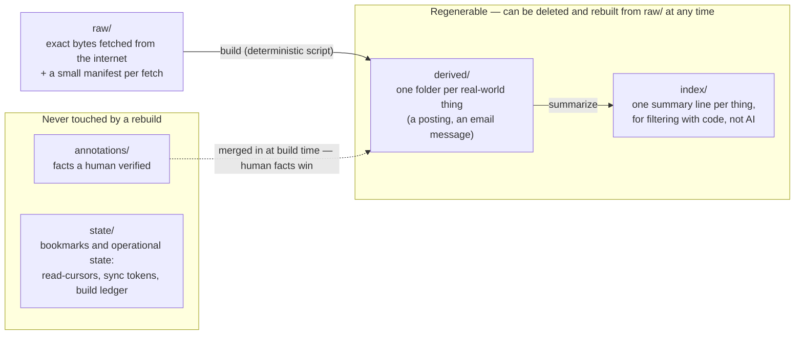

# 01 — Store core: the filesystem-as-database contract

**Status:** ACCEPTED (owner sign-off 2026-07-21). All five of this doc's
decisions are answered and folded into the text below; the record lives in
[design-decisions/raw-data-layer-decisions.md](../../../design-decisions/raw-data-layer-decisions.md)
and a compact summary in [Decisions (resolved)](#13-decisions-resolved).
Implementation not started. Writing follows
[docs/design/STYLE.md](../STYLE.md).

Part of the [raw-data-layer family](README.md). The two consumers of this
contract are the [job-postings pipeline](02-job-postings-pipeline.md) and the
[email store](04-email-download-categorization.md).

---

## For the human reviewer

**Problem this solves.** Every fetch result today dies with the session:
a parsing bug destroys the data it mis-parsed, nothing has a timeline, and
every question costs a re-fetch plus AI review. This document defines one
generic storage contract — directory zones, write discipline, versioning —
that every data domain (jobs, email, future sources) uses identically, so a
person who learns the pattern once can navigate all of them.

**What it will look like.** Each domain gets five directory zones. The
diagram shows the only fact that matters about them: which zones are
disposable and which are irreplaceable.




Same picture, plain text:

```
┌──────────────────┐   build    ┌──────────────────┐  summarize  ┌──────────────────┐
│ raw/             │ ─────────▶ │ derived/         │ ──────────▶ │ index/           │
│ exact fetched    │  (script)  │ one folder per   │             │ one line per     │
│ bytes; append-   │            │ real-world thing │             │ thing; filter    │
│ only; immutable  │            │ (posting, email) │             │ with code, no AI │
└──────────────────┘            └──────────────────┘             └──────────────────┘
 NEVER regenerable               REGENERABLE — both boxes can be deleted and
 (the source of truth)           rebuilt from raw/ at any time

┌──────────────────┐
│ annotations/     │  facts a human verified — merged into derived/ at build
│                  │  time, and a human fact always beats a machine opinion
├──────────────────┤
│ state/           │  read-cursors, sync tokens, build ledger, frozen facts —
│                  │  operational state, not regenerable
└──────────────────┘
 NEVER touched by a rebuild
```

*Takeaway: only* `raw/` *is irreplaceable, and only* `annotations/` *+* `state/`
*carry non-recomputable decisions. Everything in the "regenerable" box is a
cache of code output — when code improves, we rebuild it wholesale instead of
migrating it.*

**Pros:** bugs become recoverable (fix the code, rebuild the derived data);
breaking schema changes need no migration scripts for the regenerable zones;
humans navigate with `ls` and `cat` plus one resolver command; agents query
with scripts instead of re-reading raw data; one pattern serves every domain.

**Cons / costs:** disk growth needs a retention policy — and pruning raw data
genuinely limits the "rebuild anything" promise (stated honestly in
[Retention](#9-retention-and-growth)); a build step now sits between
"fetched" and "usable"; determinism must be pinned and tested, not assumed;
more upfront code than ad-hoc caching.

**Recommendation:** adopt as specified. All five reviews independently
endorsed the architecture (right pattern, right scale, right rejected
alternatives) while overturning several mechanics — every correction is now
part of this spec and listed in
[What the reviews changed](#12-what-the-reviews-changed).

---


## 1. Zones and their contracts

The five zones differ on exactly two axes — who may write, and whether the
contents can be regenerated:


| Zone           | Holds                                                          | Mutability                    | Regenerable?               | Who writes                                                  |
| -------------- | -------------------------------------------------------------- | ----------------------------- | -------------------------- | ----------------------------------------------------------- |
| `raw/`         | Upstream responses, byte-exact, plus one manifest per fetch    | Append-only, immutable        | **No — source of truth**   | Fetchers only                                               |
| `derived/`     | One folder per entity: current state + event history           | Rebuilt wholesale by builders | Yes, from raw              | Builders only                                               |
| `index/`       | Compact per-entity summary lines for code-side filtering       | Rebuilt wholesale by builders | Yes, from derived          | Builders only                                               |
| `annotations/` | Facts a human verified ("JD text says hybrid")                 | Append/edit                   | **No — human judgment**    | Humans (incl. explicit human confirmation of an AI finding) |
| `state/`       | Cursors, sync tokens, build ledger, frozen facts, key registry | Mutable                       | **No — operational state** | Builders, sync engines, query tools                         |


`state/` exists because the reviews found three kinds of data that are
neither raw, nor regenerable, nor human judgment: consumers' read-cursors,
email sync tokens, and the builder's own bookkeeping. The first draft filed
cursors under `index/` — which meant every rebuild's swap silently destroyed
every consumer's place. Anything non-recomputable now lives outside the
rebuild's blast radius by construction.

Seven named rules make the table true in practice:

- **Capture-before-parse.** Fetchers write the raw payload to disk *before*
attempting to parse it. A parse failure with retained raw is a fixable
bug; a parse failure without raw is permanent data loss.
- **One-way flow.** Builders read raw and write derived/index. Nothing ever
writes "upstream". Skills read derived, index, annotations, state — never
raw directly (one sanctioned resolver command excepted, see
[Agent ergonomics](#6-agent-ergonomics)).
- **Provenance everywhere.** Every derived artifact records which fetches
produced it and which code version built it, so "is this stale relative
to a code fix?" is mechanically answerable.
- **Blast-radius protection.** Rebuilds may delete and recreate all of
`derived/` and `index/` but never touch `annotations/` or `state/`.
Builders merge annotations into derived views at build time (the human
fact wins over the machine opinion and is marked as human-sourced) — and
a rebuild **fails its verification step if any annotation no longer
matches an entity**. Orphaned human judgments are a loud error, never
silent.
- **Degrade, don't block.** A store *write* failure warns and the live
operation (search, handoff, draft) continues. A store *read* failure
(torn file, version mismatch, missing index) makes the tool behave as if
the store were empty, with a warning naming the repair command. No store
condition may ever block a fetch, a search, or a handoff — the store is
memory, and missing memory is not an error. (The first draft hard-failed
on version mismatch; the token-economics review showed that would let a
store bug block a job search that didn't even need the store.)
- **Opinions are not judgments.** Only *human* judgments live in
`annotations/`. An unconfirmed AI verdict is a versioned machine opinion
inside the rebuild blast radius, so a fixed classifier really does re-run
everywhere. When a rebuild's recomputed opinion disagrees with an
existing human annotation, the conflict is queued for human review
(`state/annotation-conflicts.jsonl`) — the annotation keeps winning until
the human resolves it, but the disagreement is never invisible. (The
adversarial email review showed the first draft made wrong AI verdicts
immortal.)
- **Raw may be locally absent.** (Owner requirement, sign-off 2026-07-21:
the store runs on multiple laptops, and raw blobs are synced between them
*manually* — any given machine may be missing some or all payload blobs.)
Every builder, query tool, and validator must work when a manifest is
present but its blob is not: builders keep the existing derived entity
(or carry frozen facts) instead of erroring; `validate_store.py` reports
the four blob states defined in [Retention](#9-retention-and-growth) —
`present`, `pruned`, `not-synced-here`, `corrupt` — and `not-synced-here`
is informational, never a failure.
Only operations that *specifically need the bytes* (re-parse, `store_show
--raw`) may refuse, and they name the missing blob and the machine-sync
remedy.


## 2. Raw zone: manifests and blobs

The raw zone separates *what we received* (payload blobs — upstream's bytes,
schema never under our control) from *what we know about receiving it* (the
manifest — our envelope, fully under our control).

```
<domain>/raw/
├── _blobs/                          # content-addressed payload store
│   └── ab/abf3c9d2….json.zst        # named by sha256 of the UNCOMPRESSED bytes
└── <source>/                        # greenhouse/  jobspy-linkedin/  …
    └── 2026/07/21/                  # UTC date of CAPTURE (never source-claimed dates)
        └── 20260721T093000Z-000142-a1b2c3/   # timestamp + per-run sequence + suffix
            └── manifest.json
```

A manifest looks like this (all examples in this family use the fictional
Jordan-Rivers universe — `examplecorp`, `profile-01`, `acct-01`):

```json
{
  "envelope_schema": 1,
  "fetch_id": "20260721T093000Z-000142-a1b2c3",
  "group_id": "20260721T093000Z-board-examplecorp",
  "group": {"expected": 14, "member": 3, "attested_complete": null},
  "source": "greenhouse",
  "operation": "board",
  "request": {"url": "…", "params": {}},
  "status": 200,
  "response_headers": {},
  "item_count": 212,
  "fetched_at": "2026-07-21T09:30:00Z",
  "duration_ms": 412,
  "tool_version": "capture-lib 1 / search_jobs @ <git-sha>",
  "payload": {"blob": "abf3c9d2…", "bytes_raw": 148223, "content_type": "application/json"},
  "context": {"company": "examplecorp", "profile": "profile-01"}
}
```

Rules that came out of review:

- **Fetch groups.** One logical observation is often many HTTP requests (a
Workday board = several search calls plus per-posting detail calls).
Member manifests share a `group_id`, and the fetcher finishes by writing
a group manifest attesting `complete: true/false` with expected vs
achieved counts. Anything that infers from *absence* (the job-postings
lifecycle) may only consume attested-complete groups — completeness is
never inferred from HTTP 200 alone, because a truncated 200 looks exactly
like a complete one.
- **Over-capture from day one.** Response headers, item counts, applied
query terms and caps, pagination state. Envelope fields can be added
later but never backfilled for data already captured — so the boundary
captures more than the first reader needs.
- **Non-personal identifiers.** Manifest `context` values that identify the
owner (profile labels, mailbox names) are neutral slugs (`profile-01`,
`acct-01`) resolved through a private lookup file
(`state/identifiers.yaml`). No real name or email ever appears in a path,
manifest, or query output — so an accidentally quoted manifest can't leak
identity. The owner accepted this with the condition "make sure AI won't
make mistakes", so the safeguards are mechanical, not behavioral:
**agents never type a slug by hand** — slugs are allocated and resolved
only by the store library (which assigns the next free `profile-NN`/
`acct-NN` and refuses free-form input); the writer validates every slug
field against the strict pattern `(profile|acct)-[0-9]{2}` at write time,
so a real label physically cannot land in a manifest; the lookup file
lives in `state/` (git-status per the tracked-zones decision, private
overlay only) and the leak guard's token scan covers the mapped real
values so any escape into the public tree still trips it.
- **Blob mechanics.** The blob's name is the sha256 of its *uncompressed*
bytes (the compression codec is a storage detail, never part of
identity); blobs are verified against their name on read (bit-rot check);
the blob is written before the manifest, and **manifest presence is the
commit marker** — a fetch directory without one is debris from a crash,
skipped by builders and swept by the retention job (this sweep applies
only under `raw/<source>/`; the `state/` zone is exempt by contract).
- **Failed fetches are captured too** (HTTP errors, empty bodies). Failure
history is data — "this board has been erroring for a week" becomes
visible, and failed groups are exactly what lifecycle inference excludes.
- **Honest dedup math.** Content-addressing dedupes *whole payloads*: an
unchanged board costs ~~500 bytes/day (manifest only), but a 300-posting
board where one posting changes daily stores a full new blob daily.
Dedup helps static boards; zstd compression (~~8–10× on posting text)
helps everyone; the garbage-collection sizing discussion in
[Retention](#9-retention-and-growth) uses this honest model.


## 3. Derived zone: entity folders

One folder per real-world thing, laid out so a person can guess the path:

```
<domain>/derived/<entity-type>/<partition>/<entity-key>/
├── <entity>.yaml        # current state; carries schema_version
├── events.jsonl         # append-only history of observed changes
└── …large artifacts (e.g. jd.md), content-versioned when they change
```

- Entity YAML files are the human investigation surface — one `cat` answers
"what do we know about this posting and where did each fact come from".
- Path components are **lowercase-only slugs** (`[a-z0-9-]`). The real
store lives on a case-insensitive Mac filesystem while CI runs on Linux;
mixed-case keys would collide on one platform and not the other. A
case-only collision is a build error, never a silent merge.
- Events carry an idempotency identity (entity + fetch + event type), so a
builder crash and re-run cannot append the same history twice.

**Incremental and full builds are the same code path.** The builder
processes fetches in one canonical order (the build ledger's order — see
[Write discipline](#8-write-discipline-and-concurrency)) whether running
incrementally or from scratch, and derived state is a pure function of the
processed set. A full rebuild builds aside into a fresh directory, verifies
(schema validation, entity counts, 100% annotation matches), then atomically
swaps. Readers keep using the old generation during the build; fetch capture
is never blocked by one.

## 4. Index zone: one line per entity

`index/` holds compact JSONL files — the ~15 fields filters actually use,
one line per entity — sized for grep and scripts. Humans investigate in
`derived/`; agents and code filter here.

Every index file opens with a header line:

```json
{"_schema": 3, "built_at": "…", "note": "machine-generated — do not cat into context; use query_postings.py"}
```

Readers check `_schema` and, per the degrade-don't-block rule, treat a
mismatch as "store is cold, run the rebuild command" — never a hard stop of
live work. The `note` is a deliberate tripwire for an agent that dumps the
file against guidance.

## 5. Timeline and cursors

Two regenerable structures give the append-only timeline:

1. **Per-entity** `events.jsonl` — the entity's biography.
2. `index/by-day/<date>.jsonl` — the same observations bucketed by UTC
  capture day, so "what happened this week" is a seven-file read.

Together with the never-deleted manifests these form the **observation
log**: even after a payload blob is pruned, its manifest still proves
"source S was observed at time T with content-hash H" — which is what keeps
first-seen/last-seen timelines re-derivable forever.

**Cursors** are each consumer's saved place ("the shortlist review has
processed everything up to here"). Two review-driven rules:

- They live in `state/` (a rebuild must not reset every consumer's place).
- They advance on the builder's **materialization sequence number**, not on
timestamps. Reason: when a bug fix retroactively materializes postings
that were wrongly suppressed weeks ago, those postings carry old
first-seen dates — a time-based cursor would skip exactly the recovered
data the store exists to recover. A sequence cursor surfaces them in the
next delta.
- Agent contract: advance a cursor only after the delta was *acted on*
(reviewed, handed off) — never on mere query success — and a manual
`--since <sequence>` override always exists, so a mis-advanced cursor is
recoverable without a rebuild.


## 6. Agent ergonomics

The store must be cheap for agents, not just correct. Four mechanisms:

- **A generated map-and-cookbook.** `data_root/README.md` (regenerated by
the builder, ~1 page) lists the zones, domains, schema versions, query
one-liners, and the three copy-paste recipes a stuck investigator needs:
grep an index past its header line; resolve an entity to its blob;
decompress and pretty-print a blob. It is the only store file an agent
reads cold. It lives inside the private data root, and its contents are
store-derived — so they must never be pasted into public surfaces (see
[Content egress](#11-content-egress)). It is also added to the
instruction-budget checker so the map can't quietly bloat.
- **Compact query output.** Query tools print a short table plus a count by
default; `--jsonl`/`--full` are opt-ins; internal hashes and fetch IDs
appear only under `--debug`.
- **A hard guardrail for consuming skills:** never `cat` index files, raw
manifests, or blobs into context — always the query tool; bulk analysis
runs in subagents that return digests.
- **A sanctioned raw-access path for investigations:**
`store_show.py <entity-key> [--raw]` resolves entity → manifest → blob and
prints the decompressed payload in one command. Without it (as the
human-ergonomics review demonstrated by walking real investigation
scenarios), a human chasing "why was this message categorized wrong?"
dead-ends at a hash-named compressed blob four hops away. The `zstd`
binary becomes a stated toolkit dependency.


## 7. Schema evolution and breaking changes

Each zone ages differently, and that asymmetry is the design:


| Zone                | Versioning                       | Breaking-change procedure                                                                                                       |
| ------------------- | -------------------------------- | ------------------------------------------------------------------------------------------------------------------------------- |
| raw payloads        | none — upstream owns the schema  | Upstream broke us: fix the parser, rebuild. Raw untouched.                                                                      |
| raw manifests       | `envelope_schema`, additive-only | Never break; manifests are forever. A true break needs `envelope_schema: 2` plus readers that handle both — accepted only here. |
| derived + index     | `schema_version` per artifact    | Bump the version → full rebuild from raw → verify → atomic swap. No migration scripts, no dual-read code.                       |
| annotations + state | `schema_version` per file        | The only zones with real migrations: numbered idempotent scripts, run explicitly, kept rare by keeping these schemas tiny.      |


Why rebuild instead of migrate: migration scripts accumulate compatibility
code forever, and each is its own bug surface. A rebuild exercises exactly
one code path — the current one — and doubles as a regression test of the
whole pipeline against all historical raw data. It matches the owner's
standing no-backward-compatibility preference, and it is only possible
*because* raw is kept.

A public schema registry backs this: JSON Schema files in
`scripts/shared/store/schemas/` (one per artifact type per major version)
plus `validate_store.py`, which walks a data root and validates everything
it recognizes, zone-aware. CI runs it against the fictional fixture store in
`examples/data/`; the gardener runs it against the real store.

### The determinism contract

"Deterministically re-derivable" is a tested property, not a slogan. The
data-engineering review showed the first draft promised byte-identical
rebuilds while stamping wall-clock times into artifacts — structurally
impossible. The pins:

- Every timestamp in derived/index derives from manifest fetch times, never
the build's wall clock. Build-time metadata (`built_at`) lives only in
the ledger entry in `state/`, which is excluded from determinism
comparisons.
- One canonical serializer: sorted YAML keys, pinned float formatting, LF
endings, UTC timestamps with `Z`, lowercase-slug paths.
- One canonical processing order shared by incremental and full builds,
with an **incremental-equals-rebuild** equivalence test in CI — not just
rebuild-equals-rebuild.
- Semantic content hashes (e.g. "did this JD change?") are computed over
*normalized* text, and the normalizer itself is versioned — a normalizer
change is treated like a schema bump, otherwise improving it would make
every stored document look "changed".
- Clock discipline: capture stamps are checked for monotonicity against the
ledger head; a run whose clock went backwards warns and is excluded from
any absence-based inference, so an NTP jump cannot fabricate history.


### Identity pinning (the key registry)

Entity keys are computed by versioned code, and identity code improves over
time — which threatens anything that *points at* a key. The rule: **an
entity that has annotations, or that an application folder references, is
never silently re-keyed.** The builder maintains `state/key-registry.yaml`;
once a key is pinned there (first annotation, first reference from an
application), identity improvements may add aliases to that entity but may
not move it — a proposed re-key of a pinned entity queues for human
confirmation instead. Unpinned entities re-key freely on rebuild, because
nothing external points at them. This is what makes "annotations survive
everything" true rather than aspirational: both the data-engineering and
adversarial-jobs reviews showed the first draft orphaning human judgments
whenever the URL canonicalizer improved.

## 8. Write discipline and concurrency

- All writes are write-temp-then-rename, with the temp file in the *same
directory* as its target — rename is only atomic within one filesystem,
and a temp dir on another volume silently downgrades it to a copy.
Multi-file logical writes put the commit marker (manifest, ledger entry)
last.
- **Fetchers never take a lock.** Raw capture appends into unique fetch
directories with content-addressed blobs, so concurrent captures — two
drafting subagents both scaffolding applications, a parallel search — are
safe by construction (a same-blob race is a no-op rename). The first
draft locked fetchers, which would have made parallel drafting agents
fail or stall; the token-economics review killed that.
- **Builders are the single writer** for derived/index, enforced by a
per-domain lock file in `state/` (stale after a few minutes; a second
builder **fails fast** with a clear message — decided, see
[Decisions](#13-decisions-resolved); a skipped incremental build costs
nothing because the ledger catches it up next run). Readers never lock.
- **A build ledger replaces timestamp watermarks.**
`state/build-ledger.jsonl` records every fetch already processed; each
build processes the set difference (all committed manifests minus the
ledger). The obvious alternative — "process everything newer than the
last build" — permanently skips any fetch that *started* before a build
but *committed* after it, because fetch IDs are stamped at fetch start.
Set difference has no such hole.
- JSONL appends are single writes of complete lines; every reader tolerates
a torn final line (crash artifact), and the next build repairs it by
truncation and re-derivation — nothing is lost, because raw is the truth.
- **Backups and sync services:** the data root must live on a local,
non-cloud-synced volume (Dropbox/iCloud-style sync breaks rename
atomicity and lock files). Backup is the machine backup plus optional
rsync — stated in the generated store README.


## 9. Retention and growth

Raw grows forever by default. Retention knobs exist — and using them
**bounds the rebuild promise**, which this design states plainly instead of
papering over (the first draft shipped "prune at 180 days" and "rebuild
anything anytime" side by side; the data-engineering review pointed out they
are mutually exclusive for pruned entities):

- Manifests are never pruned — they are the observation log.
- A payload blob is deletable only when **no live manifest whose retention
class keeps it** still references it. Blobs are shared by content across
partitions and sources, so "delete blobs in old date folders" is unsafe;
reference counts are computed at sweep time, never cached and trusted.
- Before any blob that feeds a materialized entity is pruned, the builder
snapshots that entity's source-derived facts into
`state/frozen-facts/<entity-key>.yaml`. A later rebuild that hits pruned
raw carries the frozen facts forward, marked as carried — the explicit,
bounded exception to "everything re-derives from raw", instead of a
silent data hole.
- The gardener gains a store routine: zone sizes, orphaned blobs, reference
audits, manifest-less directories, torn tails, stale locks, cursor and
queue ages, annotation-conflict backlog. Dry-run by default, like every
gardener routine.
- Blob availability/integrity is a four-state property, and tooling never
conflates the states: `present` (verified), `pruned` (a retention
tombstone exists), `not-synced-here` (manifest present, blob absent, no
tombstone — normal in the owner's multi-laptop, manually-synced setup),
and `corrupt` (blob present but fails its hash check). Only `corrupt` is
an error.

### The GC config (decided 2026-07-21)

The owner replaced the fixed "keep N days" options with a real
garbage-collection expression language over the **two dates that actually
matter** — a rule the first draft conflated:

- **posting/reposting date** — what the source claims about the job, and
- **last-observed date** — the last time *we* saw it live in a fetch.

`retention.yaml` per domain accepts per-tier rules combining independent
filters on those dates, with `all_of` (AND) as the default combinator and
`any_of` (OR) or a single filter also supported:

```yaml
# retention.yaml (jobs domain) — example shape, owner-editable
tiers:
  aggregator_sweeps:
    prune_blobs_when:            # AND is the default combinator
      all_of:
        - posting_date_older_than_days: 90
        - last_observed_older_than_days: 30
  boards_and_jds:
    prune_blobs_when: never      # high-value cohort keeps raw forever
```

Prune mechanics are unchanged by the config: manifests are never pruned,
reference counts gate every blob deletion, and frozen-facts snapshots are
written first. The config only decides *which* blobs become candidates.
Ships with conservative values (`boards_and_jds: never`; sweeps at the
example thresholds above) for the owner to tune.


## 10. Alternatives considered


| Alternative                                                          | Why rejected                                                                                                                                                                                                                                                                                                                                                                                                                      |
| -------------------------------------------------------------------- | --------------------------------------------------------------------------------------------------------------------------------------------------------------------------------------------------------------------------------------------------------------------------------------------------------------------------------------------------------------------------------------------------------------------------------- |
| **SQLite as the store**                                              | Opaque to `ls`/`cat`/git-diff — humans can't investigate without tooling, and grep-ability by agents is the dominant requirement. SQLite's own pile-of-files critique (transactions, incremental update speed) is acknowledged; the pre-decided escape hatch is: if index files exceed ~10 MB or a real concurrent-writer need appears, an SQLite **cache derived from the store** is sanctioned. SQLite as the *truth* never is. |
| **Keep enriching the existing snapshot cache** (`tmp/search_cache/`) | Snapshots are per-profile, pre-filter, short-TTL, and mutable — no identity, no timeline, no cross-run dedup. Fixing all four means building this design inside a directory named `tmp/`. (Snapshots do stay for their within-session job — see the [job-postings integration](02-job-postings-pipeline.md#6-pipeline-integration).)                                                                                              |
| **Git as the database** (commit every fetch to the overlay repo)     | Git history of large rewritten JSON balloons the repo and makes it unusable; content-addressed blobs dedupe without weaponizing git. Git stays right for the small zones — decided as the tracked-zones split in [Decisions](#13-decisions-resolved).                                                                                                                                                                               |
| **Per-run folders instead of per-entity folders**                    | Optimizes writing, ruins reading: "history of posting X" would scan every run folder ever. Entities are what humans and agents query; run history survives anyway via manifests and the ledger.                                                                                                                                                                                                                                   |
| **Version fields on every JSONL line**                               | Line-level versions invite mixed-version files, which invite dual-read code. Whole-file versioning plus rebuild keeps every file single-version by construction.                                                                                                                                                                                                                                                                  |


## 11. Content egress

The store is a large corpus of real personal data that agents read — and
could quote outward. The leak guard scans tracked public files; it cannot
catch store content quoted into a public PR description, eval record, or
benchmark table. Three controls:

1. **An agent-facing rule** (lands in the agent contract at integration
  time): no store-derived content — company names with dates, profile or
   account identifiers, email subjects, bodies, query-table rows — in
   public PR descriptions, evals, benchmark rows, or commit messages.
   Aggregate counts are fine ("212 postings"); rows are not.
2. **Neutral identifier slugs** (decided — see
  [the raw-zone rules](#2-raw-zone-manifests-and-blobs)) make the worst
  accidental paste structurally less harmful.
3. **A benchmark gate:** any benchmark row measured against a real store is
  checked to be free of personal identifiers before it lands in a tracked
   file (an acceptance item in the [execution plan](execution-plan.md)).


## 12. What the reviews changed

Five reviews ran against the first draft: three angle reviews
(data-engineering, token-economics/agent-behavior, human-ergonomics/privacy)
and two adversarial reviews (jobs layer, email layer). Findings that changed
*this* document — each stated in full, with where the fix lives:


| What the review found (lens, severity)                                                                                                                                                                       | How this design now handles it                                                                                                                                                                                                                  |
| ------------------------------------------------------------------------------------------------------------------------------------------------------------------------------------------------------------ | ----------------------------------------------------------------------------------------------------------------------------------------------------------------------------------------------------------------------------------------------- |
| Retention pruning silently broke the "rebuild anything from raw" promise, and blobs shared across retention classes could be deleted while still referenced. (data-engineering + adversarial-jobs; blocker)  | Reference-counted deletion, frozen-facts snapshots before pruning, and an honest statement that retention bounds the promise — [Retention](#9-retention-and-growth).                                                                            |
| Byte-identical rebuilds were impossible because artifacts embedded build-time wall clocks, unpinned serialization, and undefined processing order. (data-engineering; blocker)                               | [The determinism contract](#the-determinism-contract): manifest-derived timestamps, canonical serializer, one processing order, incremental-equals-rebuild test.                                                                                |
| Consumers' cursors lived inside the rebuild blast radius, so any rebuild reset every consumer's place and made all history look "new". (data-engineering; blocker)                                           | The `state/` zone — [Zones](#1-zones-and-their-contracts) — plus sequence-based cursors in [Timeline and cursors](#5-timeline-and-cursors).                                                                                                     |
| Human annotations were keyed by machine-computed keys, so identity-code improvements silently orphaned verified facts. (data-engineering + adversarial-jobs; blocker)                                        | [Identity pinning](#identity-pinning-the-key-registry) plus the rebuild-fails-on-orphaned-annotation check in [Zones](#1-zones-and-their-contracts).                                                                                            |
| The incremental build's timestamp watermark permanently skipped fetches that started before but committed after a build; crash-reruns double-appended events. (data-engineering + adversarial-jobs; major)   | The build ledger (set-difference processing) and idempotent event identities — [Write discipline](#8-write-discipline-and-concurrency), [Derived zone](#3-derived-zone-entity-folders).                                                         |
| Locking fetchers broke the toolkit's own parallel-subagent workflow (two drafting agents both capture during handoff). (token-economics; blocker)                                                            | Fetchers never lock; builders are the single writer — [Write discipline](#8-write-discipline-and-concurrency).                                                                                                                                  |
| A store read failure could hard-block a live job search that didn't need the store. (token-economics; blocker)                                                                                               | The degrade-don't-block rule — [Zones](#1-zones-and-their-contracts).                                                                                                                                                                           |
| Agents would predictably `cat` a 12k-line index or a compressed blob into context. (token-economics; major)                                                                                                  | Index header tripwire + the never-cat guardrail — [Index zone](#4-index-zone-one-line-per-entity), [Agent ergonomics](#6-agent-ergonomics).                                                                                                     |
| Real personal identifiers (profile label, mailbox name) were baked into manifest fields and paths — every quoted manifest leaked identity. (human-ergonomics/privacy; major)                                 | Neutral slugs with a private lookup — [Raw zone](#2-raw-zone-manifests-and-blobs), decided — see [Decisions (resolved)](#13-decisions-resolved).                                                                                       |
| Humans investigating "why was this classified wrong?" dead-ended at hash-named compressed blobs; no sanctioned resolver existed. (human-ergonomics; major)                                                   | `store_show.py` + the generated cookbook — [Agent ergonomics](#6-agent-ergonomics).                                                                                                                                                             |
| Store content quoted into public PRs/evals/benchmarks was an unscreened leak vector. (human-ergonomics; major)                                                                                               | [Content egress](#11-content-egress).                                                                                                                                                                                                           |
| Mutable email sync state filed under `raw/` would be garbage-collected by the retention sweep. (adversarial-email; major)                                                                                    | Sync state lives in `state/`; the sweep is scoped to `raw/<source>/` only — [Raw zone](#2-raw-zone-manifests-and-blobs).                                                                                                                        |
| Unconfirmed AI verdicts stored as annotations became immortal wrong answers. (adversarial-email; major)                                                                                                      | The opinions-are-not-judgments rule + conflict queue — [Zones](#1-zones-and-their-contracts).                                                                                                                                                   |
| Smaller gaps: clock skew fabricating history, macOS case-insensitive path collisions, cloud-sync breaking rename atomicity, no blob integrity check, long rebuilds blocking reads. (data-engineering; minor) | Clock monotonicity guard, lowercase slugs, local-volume requirement, verify-on-read, build-aside reads — sections [3](#3-derived-zone-entity-folders), [7](#7-schema-evolution-and-breaking-changes), [8](#8-write-discipline-and-concurrency). |


## 13. Decisions (resolved)

All five decisions were answered by the owner on 2026-07-21. The
authoritative record (with the full original options) is
[design-decisions/raw-data-layer-decisions.md](../../../design-decisions/raw-data-layer-decisions.md);
this table is the working summary, and every answer is already folded into
the design text above.

| Decision | Owner's answer | Where it landed in this doc |
| --- | --- | --- |
| Track the store's small zones in the overlay git repo? | Yes — track `derived/`, `index/`, `annotations/`, `state/`; gitignore `raw/`. **Plus a new requirement:** everything must work with locally missing raw (multi-laptop, manually-synced setup). | The tracked-zones split stands; the new "raw may be locally absent" rule in [Zones](#1-zones-and-their-contracts) and the three blob-absence states in [Retention](#9-retention-and-growth) |
| Retention defaults for raw payloads | Replaced fixed day-counts with a **GC expression config** over posting-date and last-observed-date filters, AND by default, OR/single-filter supported | [The GC config](#the-gc-config-decided-2026-07-21) |
| Builder lock behavior on contention | Fail fast | [Write discipline](#8-write-discipline-and-concurrency) |
| Size budget for the public example store | Under 100 KB as a **soft threshold**: exceeding it warns a human; a human may approve and raise the (configurable) threshold | Execution-plan Stage 0 (the fixture check warns, never silently blocks or silently grows) |
| Neutral slugs for profile/account identifiers | Yes, with "make sure AI won't make mistakes" | Mechanical safeguards in [the raw-zone rules](#2-raw-zone-manifests-and-blobs): library-allocated slugs only, strict write-time pattern validation, leak-guard coverage of the mapped real values |

## 14. Human questions / additional tasks

*Owner space — anything written here is picked up by the next agent session
(see the async-collaboration contract in `AGENTS.md`). Questions get
answered in place; tasks get filed into `todo/` and linked back here.*

- (none right now)
