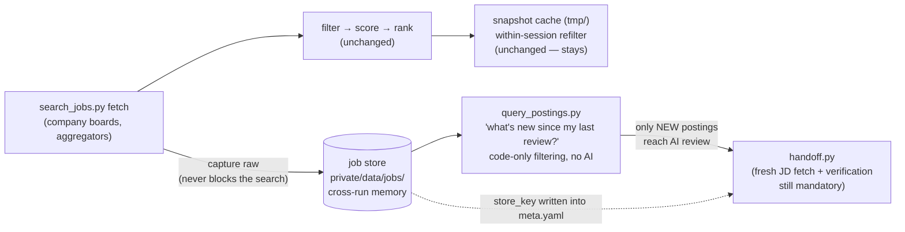

# 02 — Job postings: capture, identity, code-only filtering

**Status:** accepted and implemented. Capture, builder/query, and pipeline
integration shipped in PRs #50–#52. The committed core
(capture, identity, index, query, JD reuse) is confirmed; the owner chose
**on-demand polling**, so closure inference is not built at all (see
[the lifecycle note](#4b-lifecycle-not-built-decided-2026-07-21));
suppressed sweep rows get a review queue; log consolidation is deferred to
the todo queue. Record:
[design-decisions/raw-data-layer-decisions.md](../../../design-decisions/raw-data-layer-decisions.md);
summary in [Decisions (resolved)](#11-decisions-resolved). The remaining
follow-ups are the multi-day capture measurement and the O(new) incremental
build optimization. Writing follows [docs/design/STYLE.md](../STYLE.md).

Builds on [the store core](01-store-core.md); implementation steps in
[the execution plan](execution-plan.md).

---


## For the human reviewer

**Problem this solves.** The search pipeline fetches thousands of postings
per run and throws them away. Today we cannot: skip re-reviewing a posting
rejected last week; re-label stored postings after fixing a classifier (like
the known visa false-negative bug); answer "what did this company post this
month"; re-filter results beyond the 6-hour snapshot cache; or link an
application folder to the posting's history.

**How it fits the existing pipeline** — the store sits *beside* the search
flow as memory, never in front of it as a gate:




Same picture, plain text:

```
search_jobs.py fetch ──▶ filter → score → rank ──▶ shortlist        (all unchanged)
(boards, aggregators)          │
      │                        └──▶ snapshot cache (tmp/) — within-session
      │                             refilter + variant audit          (unchanged)
      │ capture raw — NEVER blocks the search
      ▼
job store (private/data/jobs/)
      │
      ├──▶ query_postings.py  "what's new since my last review?"
      │         │             (code-only filtering — no AI, no re-fetch)
      │         └──▶ only NEW postings reach AI review ──▶ handoff.py
      │                                                       │
      └── store_key copied into the application's meta.yaml ──┘
          (handoff still requires a fresh JD fetch + verification)
```

*Takeaway: the search behaves exactly as today; the store adds memory on the
side. If the store breaks, searches don't.*

**What the reviews changed — read this before the details:**

1. **The token claims were over-sold; now they're honest.** The earlier
  token-usage program already banked the big single-session wins. Measured
   against the current benchmark, this layer is roughly **token-neutral on
   the job-search path** (arithmetic in
   [Honest token accounting](#9-honest-token-accounting)). Its real
   justification is bug recovery, durable memory, and code-based filtering
   for future needs; the big token prize is the email domain, which this
   store core unlocks.
2. **Closed/disappeared detection was unsound for half the sources — and is
  now not built at all.** Only Greenhouse, Ashby, and Lever return
   complete boards; Workday, Amazon, Apple, and Meta fetches are keyword
   samples with result caps, and SmartRecruiters is truncated at 100 —
   "absent from the fetch → the job closed" there would fabricate closures
   of live jobs, the worst possible failure for a job hunt. The reviews
   restricted closure inference to attested-complete sources; the owner
   then chose on-demand polling (sign-off 2026-07-21), so closure inference
   is unbuilt entirely — timelines are gap-tolerant and postings show
   honest last-seen staleness
   ([details](#4b-lifecycle-not-built-decided-2026-07-21)).
3. **"Everything is recoverable from raw" now has stated limits.** Postings
  that were never fetched (excluded by pre-fetch keyword lists and caps)
   are not in raw and cannot be recovered — see
   [What raw can and cannot recover](#1a-what-raw-can-and-cannot-recover).

**What the committed core looks like on disk** (all examples fictional —
`examplecorp`, `profile-01`):

```
jobs/
├── raw/greenhouse/2026/07/21/<fetch_id>/manifest.json   → _blobs/…
├── derived/postings/examplecorp/gh-1234567/
│   ├── posting.yaml      # identity, facts, code-stamped opinions, provenance
│   └── jd.md             # verbatim JD text (prior versions kept on change)
├── index/postings.jsonl  # one summary line per posting — filter with code
├── index/by-day/…        # what was observed on each day
├── annotations/gh-1234567.yaml    # human-verified facts; survive rebuilds
└── state/                # read-cursors, build ledger, key registry
```

**Pros:** classifier fixes retroactively re-label all history; "new since my
last review" is one script call; JDs are fetched once and on disk when
drafting starts; every application links to a durable posting record; any
future filtering need runs as code over the index — no AI tokens, no
re-fetch.

**Cons / costs:** a build step after fetches; identity discipline to
maintain; real work to add capture to four bespoke fetchers (Apple and Meta
don't use the shared HTTP helper today); the store is memory, not freshness —
acting on a posting still requires a fresh fetch.

**Recommendation:** accepted — build the core (Stages 0–3 of the execution
plan). Closure inference is not built (owner decision: on-demand polling,
gap-tolerant timelines); reviving it would be a new decision in
`todo/decisions/`.

---


## 1. Capture at the fetch boundary

Every fetch path gains the capture hook defined in
[the store core's raw-zone rules](01-store-core.md#2-raw-zone-manifests-and-blobs):
payload written before parsing, failed fetches captured, capture failure
warns but never fails the search, and fetchers take no locks (so parallel
subagents capture concurrently without contention).

Specifics for this domain:

- **Fetch operations are typed by what absence means.** `board` is reserved
for truly complete board dumps (Greenhouse/Ashby/Lever — attested
complete by the fetcher via the group-manifest mechanism). Keyword-
sampled, capped, or truncated fetches (Workday, Amazon, Apple, Meta,
SmartRecruiters) are `search` — samples where absence means nothing. JD
page fetches are `jd`. JobSpy output is `scrape`.
- **JobSpy honesty.** What JobSpy returns is already normalized by JobSpy —
including its unreliable remote/on-site flag and a lossy description. So
`scrape` captures are *opinion-grade evidence*: useful memory, excluded
from any "rebuild fixes classification bugs" claim. For any scraped row
that reaches a shortlist, the pipeline's existing verification step
already fetches the real posting page — captured as `jd`, which is the
actual raw for everything we act on.
- **Implementation honesty.** Greenhouse/Ashby/Lever/SmartRecruiters route
through one shared HTTP helper and get capture nearly free. Workday
(multi-request board), Amazon, Apple (cookie handshake), and Meta
(GraphQL) are bespoke flows needing explicit capture calls — costed as
real work in the execution plan, and they can land per-source without
blocking anything else.


### 1a. What raw can and cannot recover

The adversarial review's most important correction: raw contains **what the
fetchers chose to request** — no more. "Fix the bug later from raw" is a
contract with limits:


| Recoverable retroactively (it's in raw)                                                                                                                                       | NOT recoverable (never fetched, no blob exists)                                                                                                                    |
| ----------------------------------------------------------------------------------------------------------------------------------------------------------------------------- | ------------------------------------------------------------------------------------------------------------------------------------------------------------------ |
| Anything mis-parsed, mis-classified, or mis-filtered **after** fetch: visa/level/workplace labels, location verdicts, title-gate drops on fetched rows, suppressed sweep rows | Postings excluded by **pre-fetch** gates: the big-tech keyword term lists, pre-request title filters, per-source result caps — those rows produced no HTTP request |
| Every posting in a Greenhouse/Ashby/Lever board dump                                                                                                                          | The long tail of a capped Workday/Amazon/Apple/Meta search beyond its cap                                                                                          |
| JD text for anything that got a JD fetch                                                                                                                                      | The true source pages behind JobSpy rows that never got a JD fetch                                                                                                 |


Widening what's recoverable means widening what's *requested* (e.g. more
big-tech search terms) — a deliberate fetch-policy change with
respectful-polling implications. The owner chose on-demand fetching at
sign-off; any future widening is a new decision filed in `todo/decisions/`,
never done silently.

## 2. The posting entity

One YAML file per posting answers "what do we know and where did each fact
come from". Three kinds of content are deliberately kept apart — *facts*
(what the source said), *opinions* (what our code concluded, stamped with
the code version), and *human annotations* (kept in a separate zone
entirely):

```yaml
schema_version: 1
key: gh-1234567                      # identity — see next section
company: examplecorp                 # registry canonical name (an attribute, not part of the key)
source_ids:
  - {source: greenhouse, board_token: examplecorp, id: "1234567", url: "https://…"}
title: "Software Engineer, Control Plane"
location: "Austin, TX (Hybrid)"
first_seen: 2026-07-14T09:30:00Z     # OUR capture time — authoritative. Source
last_seen: 2026-07-21T09:30:00Z      #   dates never overwrite it: reposts reset
                                     #   posted dates; ATS updated-at churns on edits
facts:                               # parsed verbatim from the source
  posted_at: 2026-07-12
  salary_text: "$140,000 - $170,000"
  workplace_raw: remote              # what the source CLAIMED
opinions:                            # our classifiers — rebuildable, stamped
  visa: {label: unclear, hits: [], by: visa.py@<sha>, from: <fetch_id>}
  level: {value: L4-L5, by: job_metadata.py@<sha>, from: <fetch_id>}
  workplace: {value: hybrid, by: location.py@<sha>, from: <fetch_id>}
provenance:
  built_by: build_postings.py@<sha>
  fetch_ids: [20260714T…-000012-x1]
jd:
  file: jd.md
  content_hash: 9f31ab…              # computed over normalized text
  fetched_verbatim: true
```

The payoff of the facts/opinions split: fix the visa classifier, run
`rebuild --opinions-only`, and every posting in history gets the corrected
label, with a printed diff ("14 postings changed visa yes→no") as regression
evidence. Human annotations override opinions at build time and are joined
through source-native IDs, so they survive both rebuilds and identity-code
improvements (mechanism: [identity pinning in the store
core](01-store-core.md#identity-pinning-the-key-registry)).

## 3. Identity

A posting's key must survive the things that actually happen over a
months-long job hunt: board renames, registry edits, ATS migrations. The
first draft failed all three (it embedded the board token in the key); this
version keys on the most stable identifier available, in order:

1. **Platform-unique ATS ID, no board token:** `gh-1234567`,
  `lever-<uuid>`, `ashby-<uuid>`, `sr-<id>`. Greenhouse/Lever/Ashby/
   SmartRecruiters IDs are unique across their whole platform, so a company
   renaming its board slug (routine) cannot fork identity. Workday
   requisition numbers are only unique per company, so they're namespaced
   by the registry's canonical company name (`wd-examplecorp-R102938`) —
   which survives token renames because the registry resolves aliases.
2. **Canonicalized URL** for aggregator rows with stable embedded IDs
  (LinkedIn, Indeed): `url-<hash-of-canonical-url>`. The URL canonicalizer
   is a written, versioned spec; improving it is treated like a schema
   change, and pinned entities never silently re-key (see the key-registry
   mechanism linked above).
3. **Content key** as last resort — a hash of company + normalized title +
  *sorted* location set (sorted because some sources return locations in
   unstable order). Content-keyed entities are marked `identity: weak` in
   the index and are **excluded from lifecycle inference entirely** — a
   title tweak legitimately creates a "new" entity, and pretending
   otherwise would fabricate open/closed churn.

**ATS migrations are declared, not guessed.** When a company moves
Greenhouse→Ashby, no shared ID or URL ever exists across the boundary, so
automatic merging is impossible under conservative rules — and silence would
orphan the company's whole history. The company registry gains an optional
migration record:

```yaml
- name: ExampleCorp
  ats: ashby
  token: examplecorp
  previous: [{ats: greenhouse, token: examplecorp-old, until: 2026-06-01}]
```

The declaration *licenses* continuation matching (same company + normalized
title + JD content hash) across that one boundary, producing explicit
`migrated_from` links. Conservatism preserved; silent history loss
eliminated.

**Cross-source duplicate handling stays conservative** (and full merging is
part of the gated extension, not the core): records merge only on shared
URL/ID; company match is a hard precondition for any fuzzy text comparison —
staffing agencies post near-identical text for different real jobs; weak
matches surface as "possible duplicate" hints, never merges. A false merge
silently *hides a real job*, which is worse than a duplicate that costs a
glance.

## 4. Observations and timeline (committed core)

The builder records only **directly observed facts**: first-seen, seen,
field-changed (with old/new values; a JD text change also snapshots the
prior version), written to each posting's event log and the by-day index.
No inference, no absence-reasoning — that's the extension below. This alone
answers "what appeared this week", "when did the salary text change", and
"what does this board's history look like".

### 4b. Lifecycle: not built (decided 2026-07-21)

Detecting that a posting *closed* means reasoning from absence, and absence
is only meaningful with regular complete observations. At sign-off the
owner chose **on-demand polling with gap-tolerant timelines** — so closure
inference is not built. Concretely:

- Observations happen whenever a search or single-company re-check actually
  runs; timelines legitimately contain gaps, and every consumer treats a
  gap as "not observed then", never as "the posting was absent".
- Postings carry honest staleness ("last seen N days ago") instead of any
  inferred open/closed state; nothing anywhere claims closure.
- The earlier draft's full closure-inference spec (attested-complete-only
  sources, suspect-empty quarantine for dead endpoints, the two-absence
  rule) was pruned from this doc as no-longer-needed material; it survives
  in git history. If a scheduled polling habit ever appears, reviving it is
  a **new decision filed in `todo/decisions/`**, not a silent re-enable.
- The fetch-group completeness attestation in
  [the store core](01-store-core.md#2-raw-zone-manifests-and-blobs) stays —
  it costs one manifest per observation and keeps the door open.

Agent cheat-sheet, one line (lands in the skill's reference file): the
store never says "closed" — treat last-seen staleness as a prompt to
re-check the live board before acting.

## 5. The query surface

`query_postings.py` reads the index and derived entities (never raw) and is
the "filter with code, not AI" interface:

```bash
# The routine delta review — the whole point of the store:
query_postings.py --new-since-cursor shortlist-review --profile profile-01

query_postings.py --company examplecorp            # memory of one board
query_postings.py --visa yes --workplace remote --max-age-days 7
query_postings.py --key gh-1234567 --history       # one posting's biography
```

- Cursors ride the builder's materialization sequence (not timestamps), so
postings recovered retroactively by a bug fix still surface in the next
delta — details in
[the store core's cursor rules](01-store-core.md#5-timeline-and-cursors).
Agents advance a cursor only after acting on the delta, and a manual
override flag always exists.
- Filter semantics share the same vendored location/profile gate code as
the live pipeline, so store-side and fetch-side filtering cannot drift
apart.
- Output is a compact table by default; and per
[the content-egress rules](01-store-core.md#11-content-egress),
store-derived rows never get pasted into public PRs, evals, or benchmark
tables.

**The store is never a verification substitute — hard guardrail.** Acting on
a posting (scaffolding, drafting) requires a **fresh JD fetch in the current
session** and the same workplace/visa/location verification as today, in
both generation modes; `handoff.py` refuses to scaffold from stored facts
alone. Stored opinions *route* attention; the JD text in front of you is
what you act on. The token-economics review predicted that without this
fence, agents in the default token-saving mode would treat stored facts as
sufficient — re-creating the exact mislabeled-posting failures the earlier
live experiment caught.

## 6. Pipeline integration

Four seams, all behavior-preserving:

1. `search_jobs.py`**.** The fetch stage captures raw; a post-fetch
  incremental build updates the store; the run summary gains one line
   ("store: N tracked, M new since your last review"). **The snapshot cache
   stays exactly as is.** The first draft proposed retiring it; the
   adversarial review killed that: the snapshot's byte-identical refilter
   contract and the mandatory filter-variant audit depend on it. Snapshots
   do within-session work; the store does cross-run memory. Different
   products.
2. `handoff.py`**.** Warns when the selected posting's last-seen is stale
  (the only staleness signal — closure inference is not built); writes the
   posting's store key into the application's `meta.yaml` entry (one
   additive field in the existing schema — the durable link between an
   application and the posting's biography). The search pipeline threads
   the store key through its JSON output so handoff *copies* it — it never
   re-derives identity with a second matcher that could drift from the
   builder's.
3. **Skip logic.** The existing blacklist and search/application logs
  remain the sole skip authorities, unchanged. The store adds context
   ("you saw this in the 7/14 shortlist and ignored it"), not a second
   gate — the token-economics review showed a parallel skip mechanism
   would add agent-instruction surface for near-zero marginal skips.
   Long-term consolidation is deferred by owner decision — tracked as
   `todo/decisions/logs-as-store-projections.md`.
4. `fetch_jd.py` **/** `company_roles.py`**.** Same capture hook; a JD fetched
  once at search time is on disk, verbatim, when drafting starts.

**Where the instructions go:** one guardrail line and one pointer line in
the skill's main instruction file; query examples, cursor semantics, and the
lifecycle cheat-sheet go in the skill's reference file (unbudgeted, read on
demand) and the generated store README — protecting the instruction-size
wins the earlier token program paid for.

## 7. Capture policy: what counts as "useful" raw

Three tiers balance "keep everything for bug recovery" against disk and
index noise:


| Tier   | Data                                                                                | Policy                                                                                                                                                      |
| ------ | ----------------------------------------------------------------------------------- | ----------------------------------------------------------------------------------------------------------------------------------------------------------- |
| Tier 1 | Company-board fetches, every JD page, anything that reached a shortlist or handoff  | Full raw, keep forever by default                                                                                                                           |
| Tier 2 | Aggregator/JobSpy sweep rows                                                        | Full rows compressed; payloads prunable per [the GC config](01-store-core.md#the-gc-config-decided-2026-07-21) with frozen-facts protection; manifests forever |
| Tier 3 | Sweep rows failing *post-fetch structural* gates (foreign location, excluded title) | Present in the tier-2 payload but **not materialized** as entities; recorded in the suppressed review queue (below) plus a per-fetch "suppressed: N" counter                               |


Tier 3 is the "store only useful ones" lever: the derived and index zones
stay sized to plausible postings, while raw retains everything a post-fetch
gate suppressed. Fix a buggy gate, rebuild, and the wrongly-suppressed
postings materialize retroactively — and because read-cursors ride the
materialization sequence, they actually *surface* in your next review
instead of being silently skipped for having old dates. The limits from
[What raw can and cannot recover](#1a-what-raw-can-and-cannot-recover)
apply: pre-fetch exclusions are not in raw and do not come back.

**The suppressed review queue (owner decision, 2026-07-21).** Suppression is
auditable per-row, not just per-fetch: the builder appends one line per
suppressed row to `jobs/index/triage/suppressed-<yyyy-mm>.jsonl` carrying
the partial parsed info (company, title, location, which gate fired) plus
the raw manifest path, so a human can spot-check "what did the gates throw
away this month?" or recover one entry by hand without a full rebuild. The
queue is write-only from the pipeline's perspective — reviewing it is
optional and manual, it feeds nothing downstream automatically, and it can
never block or slow a search. It is a regenerable index artifact (rebuilt
like any index file), and its monthly files age out with their underlying
raw per the GC config.

## 8. Alternatives considered


| Alternative                                                                        | Why rejected                                                                                                                                                                                                                                                                                                                                                                                              |
| ---------------------------------------------------------------------------------- | --------------------------------------------------------------------------------------------------------------------------------------------------------------------------------------------------------------------------------------------------------------------------------------------------------------------------------------------------------------------------------------------------------- |
| Store only post-filter shortlists                                                  | The filters are exactly where our known bugs live — storing only what today's buggy filter passed defeats recovery.                                                                                                                                                                                                                                                                                       |
| Store raw only, derive on demand at query time                                     | Every question re-pays parsing over a growing history; an incremental build amortizes it once per fetch.                                                                                                                                                                                                                                                                                                  |
| Aggressive fuzzy identity everywhere                                               | False merges hide real jobs silently. Platform IDs already cover the high-value cohort precisely.                                                                                                                                                                                                                                                                                                         |
| Write-only store (capture now, reader tools only offline, no pipeline integration) | Proposed by the token-economics review; genuinely attractive (zero hot-path risk). Rejected as an *endpoint* because routine code-side filtering is an explicit goal of this design — but adopted as *sequencing*: capture and the query tool land first, pipeline integration lands last and benchmark-gated, and the degrade-don't-block rule means the hot path can always fall back to cold behavior. |
| Retire the snapshot cache                                                          | Reversed in review — see [Pipeline integration](#6-pipeline-integration).                                                                                                                                                                                                                                                                                                                                 |
| Lifecycle inference for all sources                                                | Reversed in review — fabricated closures on sampled/capped boards; the owner then chose on-demand polling, so closure inference is not built at all — see [the lifecycle note](#4b-lifecycle-not-built-decided-2026-07-21).                                                                                                                                                                                                                               |


## 9. Honest token accounting

Supplied by the token-economics review, kept verbatim in spirit: against the
current pinned benchmark (~485k tokens for one search + two drafted
applications), this layer adds ~2.5–3k tokens per run (a guardrail line,
the store README cold-read, one summary line) and saves ~2–3k per warm run
on the search leg (smaller review surface). **Net: roughly break-even on
the jobs path.** Consequences, all reflected in the execution plan:

- The cold benchmark gates the store on a **cost ceiling** (≤1k added
tokens), not a savings claim.
- A new **warm-store benchmark variant** (run the scenario twice against a
persisted store; measure run 2) is what must show the delta mechanism
working.
- The genuinely large token savings live in the email domain (mailbox
re-reads replaced by local queries) and are measured when that track
lands — not promised here.


## 10. What the reviews changed

Findings that changed this document, in plain language:


| What the review found (lens, severity)                                                                                                                                                                                      | How this design now handles it                                                                                                                                                                                                             |
| --------------------------------------------------------------------------------------------------------------------------------------------------------------------------------------------------------------------------- | ------------------------------------------------------------------------------------------------------------------------------------------------------------------------------------------------------------------------------------------ |
| "Absent from the fetch → closed" would fabricate closures for Workday/Amazon/Apple/Meta (keyword-sampled, capped) and SmartRecruiters (truncated at 100) — hiding live jobs. (data-engineering + adversarial-jobs; blocker) | Operation typing + fetcher-attested completeness; closure inference then dropped entirely at sign-off — [Capture](#1-capture-at-the-fetch-boundary), [the lifecycle note](#4b-lifecycle-not-built-decided-2026-07-21). |
| Pre-fetch keyword/title gates mean excluded postings were never fetched — "recover anything from raw" was overbroad. (adversarial-jobs; blocker)                                                                            | The explicit recoverability contract — [What raw can and cannot recover](#1a-what-raw-can-and-cannot-recover).                                                                                                                             |
| JobSpy "raw" is JobSpy's already-normalized opinion — including the wrong remote flag this design cites as its motivating bug. (adversarial-jobs; blocker)                                                                  | Scrape-tier honesty; JD page fetches are the actionable raw — [Capture](#1-capture-at-the-fetch-boundary).                                                                                                                                 |
| A dead board endpoint serving empty 200s would mass-close every posting. (adversarial-jobs; major)                                                                                                                          | Moot since closure inference is not built; the quarantine idea is preserved in git history with the pruned spec — [the lifecycle note](#4b-lifecycle-not-built-decided-2026-07-21).                                                                                                           |
| Board tokens in keys fork identity on routine renames; ATS migrations destroy first-seen history with no recovery path. (data-engineering + adversarial-jobs; blocker)                                                      | Platform-unique IDs without tokens + declared migration records — [Identity](#3-identity).                                                                                                                                                 |
| Content-keyed entities churn keys on trivial edits, fabricating open/closed noise. (both reviews; major)                                                                                                                    | Sorted-field hashing, `identity: weak` marking, excluded from lifecycle — [Identity](#3-identity).                                                                                                                                         |
| Retiring the snapshot cache would delete the substrate of the mandatory filter-variant audit and the byte-identical refilter contract. (adversarial-jobs; blocker)                                                          | Snapshots stay; claim withdrawn — [Pipeline integration](#6-pipeline-integration).                                                                                                                                                         |
| Postings recovered retroactively by a bug fix would never surface: time-based cursors skip anything with old dates. (adversarial-jobs; major)                                                                               | Materialization-sequence cursors — [Query surface](#5-the-query-surface) and [the store core](01-store-core.md#5-timeline-and-cursors).                                                                                                    |
| Handoff re-deriving identity would create a second matcher that drifts from the builder's. (adversarial-jobs; minor)                                                                                                        | Store key threaded through the search JSON; handoff copies it — [Pipeline integration](#6-pipeline-integration).                                                                                                                           |
| The token justification double-counted savings the earlier program already banked, and mistook code costs for AI costs. (token-economics; major)                                                                            | Reframed justification + honest arithmetic — [Honest token accounting](#9-honest-token-accounting).                                                                                                                                        |
| A cold single-run benchmark structurally cannot show cross-run savings — gating on it would mismeasure. (token-economics; blocker)                                                                                          | Warm-store benchmark variant + cold cost-ceiling — [Honest token accounting](#9-honest-token-accounting), [execution plan](execution-plan.md).                                                                                             |
| Agents in default token-saving mode would treat stored facts as verification, skipping the fresh-JD check that catches mislabeled postings. (token-economics; major)                                                        | The hard guardrail + handoff's fresh-JD refusal — [Query surface](#5-the-query-surface).                                                                                                                                                   |
| A parallel per-posting skip mechanism would confuse the existing skip-log authority for near-zero gain. (token-economics; major)                                                                                            | Logs stay the sole authority; store adds context only — [Pipeline integration](#6-pipeline-integration).                                                                                                                                   |
| Both reviews independently: cut lifecycle/aliasing/timeline machinery from the committed scope.                                                                                                                             | The committed-core / gated-extension split this document now leads with.                                                                                                                                                                   |


## 11. Decisions (resolved)

All three decisions were answered by the owner on 2026-07-21. Authoritative
record:
[design-decisions/raw-data-layer-decisions.md](../../../design-decisions/raw-data-layer-decisions.md).
Every answer is folded into the design text above.

| Decision | Owner's answer | Where it landed in this doc |
| --- | --- | --- |
| Materialize obviously-unsuitable sweep rows as entities? | No — keep them out of the normal pipeline, but record each in a **review queue** (partial info + raw manifest path) for optional manual review; never blocks the pipeline | [The suppressed review queue](#7-capture-policy-what-counts-as-useful-raw) |
| Should the search/application logs become store projections? | Defer — tracked as an open item in the todo queue (`todo/decisions/logs-as-store-projections.md`). The same answer also ordered the process-folder restructure: unresolved decisions now live under `todo/` (see the async-collaboration contract in `AGENTS.md`) | [Pipeline integration](#6-pipeline-integration), item 3 |
| Adopt a scheduled board-polling habit? | No — on-demand polling; timelines are allowed to have gaps | [The lifecycle note](#4b-lifecycle-not-built-decided-2026-07-21): closure inference not built, gap-tolerant timelines, honest last-seen staleness |

## 12. Human questions / additional tasks

*Owner space — anything written here is picked up by the next agent session
(see the async-collaboration contract in `AGENTS.md`). Questions get
answered in place; tasks get filed into `todo/` and linked back here.*

- (none right now)
