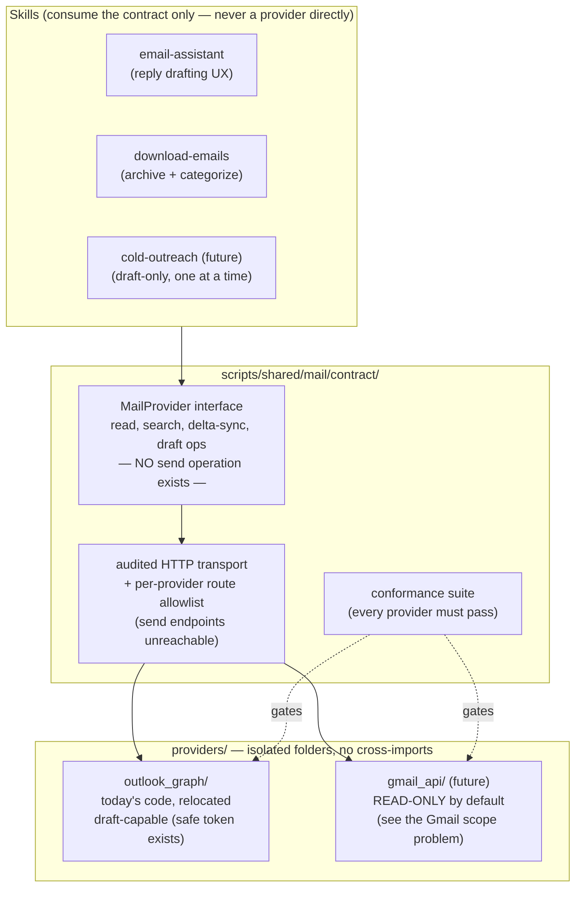

# 03 — Provider interfaces: one email contract, isolated Outlook/Gmail implementations

**Status:** ACCEPTED (owner sign-off 2026-07-21). All four decisions are
answered exactly as recommended — rename with no alias, multi-account
partitioning from day one, read-only live conformance behind `--live`, and
Gmail read-only (revisit only if Gmail drafting becomes a real daily need).
Record:
[design-decisions/raw-data-layer-decisions.md](../../../design-decisions/raw-data-layer-decisions.md);
summary in [Decisions (resolved)](#5-decisions-resolved). Implementation not
started. Writing follows [docs/design/STYLE.md](../STYLE.md).

Part of the [raw-data-layer family](README.md); the
[email store](04-email-download-categorization.md) builds on this.

---


## For the human reviewer

**Problem this solves.** Today "email" and "Outlook" are the same thing in
this repo: the assistant skill talks Microsoft Graph directly. Adding Gmail
would mean forking the skill or threading provider-conditionals through
every file. The same coupling blocks the planned email-download skill and
any future cold-outreach drafting skill, which need mailbox access without
inheriting the assistant's UX.

**What it will look like** — one abstract contract, each provider in a
completely isolated folder, skills consuming only the contract:




Same picture, plain text:

```
SKILLS        email-assistant     download-emails     cold-outreach (future)
(consume the        │                    │                    │
contract only)      └─────────┬──────────┴────────────────────┘
                              ▼
CONTRACT      MailProvider interface — read, search, delta-sync, draft ops
(safety lives         ── NO send operation exists ──
here, once)                   │
              audited HTTP transport + per-provider route allowlist
                  (send endpoints structurally unreachable)
                              │           conformance suite gates every provider
                    ┌─────────┴──────────┐
                    ▼                    ▼
PROVIDERS     outlook_graph/        gmail_api/ (future)
(isolated     draft-capable —       READ-ONLY by default —
folders, no   a send-less token     no Google scope grants
cross-imports) exists (Microsoft)   drafts without send
```

*Takeaway: safety does not live in the skills anymore — it lives once, in
the contract layer, below everything that could make a mistake.*

**Pros:** Gmail becomes an additive folder plus a config line (within the
scope limits below); every consumer skill works with any provider;
draft-only enforcement happens once, structurally; "does Gmail behave like
Outlook here?" becomes a mechanical conformance question.

**Cons / costs:** a real refactor of working, safety-critical code
(including the pre-commit hook paths); the route-allowlist checker the
safety story depends on is **new work, not existing work** (the first draft
wrongly implied it existed); Gmail's usable surface is smaller than hoped —
read-only by default, because of Google's permission model.

**Recommendation:** adopt the three-layer split and the scope rules;
sequence after the jobs store proves the pattern. The isolated-folder
discipline and the contract shape survived review unchanged; what changed is
that the safety mechanisms went from "assumed" to "explicit deliverables
with acceptance gates".

---


## 1. The contract

The `MailProvider` interface exposes only what every consumer needs:
capability discovery, folder/message listing, message reading, incremental
delta-sync (with the sync token treated as an opaque blob the caller never
parses), search, and draft operations. Two properties matter more than the
method list:

- **There is no send operation.** Not blocked — *nonexistent*. Nothing a
consumer skill can call, misuse, or be prompt-injected into calling.
- **Read-only providers are first-class.** `capabilities()` reports
`drafts: false` for a provider that cannot safely hold draft permissions
(Gmail, below), and every consumer must handle that state — the
download/categorize skill works fully against a read-only provider.

Sync-state expiry is designed as a routine path, not an error: Microsoft
expires delta tokens unpredictably, Google expires history IDs within days,
so "full resync" is the first thing implemented and delta sync is the
optimization on top.

## 2. The safety architecture — three layers, strongest first

Today's Outlook boundary is genuinely two things: no send *code*, and — the
stronger one — an OAuth token that *structurally cannot send* (Microsoft
offers mail-read/write permission separate from mail-send). The review's
hardest finding: **Google offers no such separation.**

### 2a. The Gmail scope problem, and the scope doctrine

Every Google permission scope that allows creating drafts
(`gmail.compose`, `gmail.modify`, full `mail.google.com`) **also allows
sending** — `gmail.compose` even includes a one-call "send existing draft".
There is no draft-write-without-send scope. So a Gmail provider that can
create drafts necessarily holds a token that can send mail, and no source
code scan can change what a stolen or misused token is capable of.

The contract therefore carries a **scope doctrine** every provider declares
against:

1. **Read-only mode — the Gmail default** (decided — read-only; see [Decisions](#5-decisions-resolved)):
  request only `gmail.readonly`; `capabilities().drafts = false`; drafting
   stays in Outlook (or manual). This preserves the "never hold send
   permission" rule exactly as it exists today.
2. **Owner-waived draft mode:** requires an explicit recorded owner
  decision accepting that the *token* can send while the *code* cannot,
   plus the strongest compensating controls from the next section (single
   audited transport, send endpoints — including "send draft" — denied in
   the route allowlist, no SDK, conformance probes proving all of it).

The existing skill rule "never request or accept mail-send permission"
generalizes to: **never hold a send-capable grant without a recorded owner
waiver.**

### 2b. Enforcement mechanisms — corrected from the first draft

The first draft claimed the existing draft-only checker "generalizes to scan
any provider folder". The review verified it does not: it checks a
**hardcoded list of five Outlook files**, its strongest checks are
Graph-specific (a pinned scope list, a live probe of the route policy
against Microsoft's send endpoint), and its regex layer is useless against
Google's SDK — whose methods are generated at runtime from a discovery
document, so `send` capability exists with zero matchable string in source,
and trivial dynamic-attribute tricks beat regexes anyway. Also, checking
"did the API return a draft?" *after* a mutation is detection, not
prevention.

The corrected architecture, in priority order — all of it explicit
deliverables in [the execution plan's email stage](execution-plan.md#stage-5--email-track-gated-on-its-own-sign-off):

1. **Route allowlist at a single HTTP chokepoint — the primary control.**
  Every provider routes all network I/O through the contract's one audited
   transport; each provider ships a route-policy class enumerating allowed
   method+path shapes; send endpoints are structurally unreachable. The
   conformance suite probes each provider's policy against *that provider's*
   send endpoints and fails on any pass. (This is the proven pattern from
   today's Outlook client, promoted from one implementation to the
   contract.)
2. **SDK ban inside provider folders.** Providers use the audited raw-HTTP
  transport, never Google/Microsoft SDK clients — a dynamically-generated
   API surface cannot be statically bounded, so it is not allowed to exist.
   Enforced by an import-check that **walks every file under**
   `providers/` — no hardcoded file lists, so a new provider folder is
   covered the day it appears.
3. **Draft-evidence checks as the tripwire.** Every mutation must return
  provider evidence of draft-ness (Microsoft's `isDraft: true`, Gmail's
   `DRAFT` label) and the contract wrapper hard-fails otherwise — the
   detection layer behind the prevention layers, exactly as today.
4. **Refactor bookkeeping.** The pre-commit hook's hardcoded checker paths
  update in the same PR that moves the code, and the Outlook route
   allowlist gains its new read routes (delta, folders) as an enumerated,
   reviewed diff.


### 2c. Isolation rules

1. One folder per implementation. No shared files between implementations —
  common logic graduates into the contract explicitly, or doesn't exist.
2. No cross-imports between provider folders, enforced by the same
  folder-walking check as the SDK ban.
3. Auth is per-provider (device-code + OS keyring for Microsoft; Google
  OAuth with its own keyring entry). The contract sees an authenticated
   provider, never credentials.
4. Provider and account selection via config only; accounts are neutral
  slugs (`acct-01`) per
   [the store core's identifier rule](01-store-core.md#2-raw-zone-manifests-and-blobs).
5. The conformance suite runs in CI against a **synthetic** fixture mailbox
  (generated, never seeded from real mail, `example.com` addresses only —
   so it can never fight the leak guard), and on demand against a real
   account in read-only mode behind an explicit opt-in flag
   (decided: allowed — see [Decisions](#5-decisions-resolved)).


## 3. How skills layer on top


| Skill                                                                                                        | Uses from the contract                 | Notes                                                                                                                                                                                                                                                                         |
| ------------------------------------------------------------------------------------------------------------ | -------------------------------------- | ----------------------------------------------------------------------------------------------------------------------------------------------------------------------------------------------------------------------------------------------------------------------------- |
| Today's Outlook assistant → renamed `email-assistant` (decided — see [Decisions](#5-decisions-resolved)) | review-window, read, match, draft ops  | Behavior-identical refactor; Graph specifics move into the provider folder's README; every existing guardrail keeps its tests.                                                                                                                                                |
| `download-emails` ([the email store design](04-email-download-categorization.md))                            | delta-sync, read                       | Pure archival + categorization — works fully against read-only providers, which is why Gmail-read-only still delivers that design's entire value.                                                                                                                             |
| `cold-outreach` (future, own design doc when it happens)                                                     | create-draft, list-sent                | Draft-only like everything else, plus a hard volume/ethics constraint carried from this doc: one researched draft at a time, no bulk generation. On Gmail it requires the owner waiver above, or stays Outlook-only.                                                          |
| Application-status reconciliation                                                                            | reads the email store, not the mailbox | Evidence arrives pre-linked from local data — but status changes re-verify against the stored message first (defined in [the email store's transition rules](04-email-download-categorization.md#4a-status-transitions-re-verify--the-read-the-exact-message-gate-survives)). |


**Does the same pattern apply to job sources?** The rule adopted here:
folder-per-implementation is mandatory where an implementation carries
auth, sync state, or a safety boundary (email: yes; keyed job APIs someday:
yes), and optional for stateless pure fetchers — today's job-board fetchers
stay one file. Revisit if a job source ever grows auth or state.

## 4. Alternatives considered


| Alternative                                   | Why rejected                                                                                                                                                                                                      |
| --------------------------------------------- | ----------------------------------------------------------------------------------------------------------------------------------------------------------------------------------------------------------------- |
| Fork the skill per provider                   | Every guardrail fix and matcher improvement lands twice or drifts.                                                                                                                                                |
| Provider-conditionals inside existing scripts | The classic rot path, and it violates the isolated-folders requirement outright.                                                                                                                                  |
| A third-party mail-abstraction library        | Seven operations don't justify a dependency that ships send capability, its own auth patterns, and an upgrade treadmill.                                                                                          |
| Gmail via Google's official SDK               | Rejected on safety grounds (see [enforcement](#2b-enforcement-mechanisms--corrected-from-the-first-draft)): a runtime-generated API surface defeats static analysis. Raw HTTP through the audited transport only. |
| Gmail with draft capability by default        | Rejected: no Google scope grants draft-write without send ([the scope problem](#2a-the-gmail-scope-problem-and-the-scope-doctrine)). Read-only default; owner waiver for more.                                    |
| Do this refactor before the jobs store        | Two concurrent structural changes to safety-critical code, with no dependency forcing it. Jobs first proves the store pattern cheaply.                                                                            |


## 5. Decisions (resolved)

All four decisions were answered by the owner on 2026-07-21, each matching
the recommendation. Authoritative record:
[design-decisions/raw-data-layer-decisions.md](../../../design-decisions/raw-data-layer-decisions.md).

| Decision | Owner's answer | Where it landed in this doc |
| --- | --- | --- |
| Rename the Outlook email assistant skill? | Rename to `email-assistant` at refactor time, no alias | [How skills layer on top](#3-how-skills-layer-on-top) |
| Design multi-account in from day one? | Yes — partition every zone by account now, implement single-account first | [Isolation rules](#2c-isolation-rules) and [the email store layout](04-email-download-categorization.md) |
| Allow read-only live conformance runs against the real mailbox? | Yes, behind an explicit `--live` flag, never CI | [Isolation rules](#2c-isolation-rules) |
| Gmail permission posture | Read-only (`gmail.readonly`); revisit only if Gmail drafting becomes a real daily need — that revisit is the owner-waiver path and would be a new decision in `todo/decisions/` | [The scope doctrine](#2a-the-gmail-scope-problem-and-the-scope-doctrine) |

## 6. What the reviews changed


| What the review found (lens, severity)                                                                                                                                                                                                                                                         | How this design now handles it                                                                                                                                                                                                                                                                                                   |
| ---------------------------------------------------------------------------------------------------------------------------------------------------------------------------------------------------------------------------------------------------------------------------------------------- | -------------------------------------------------------------------------------------------------------------------------------------------------------------------------------------------------------------------------------------------------------------------------------------------------------------------------------- |
| Every Google scope that permits draft creation also permits sending — the first draft's "no send operation exists" was the weaker of the two safety layers and the draft never noticed. (adversarial-email; blocker)                                                                           | [The scope doctrine](#2a-the-gmail-scope-problem-and-the-scope-doctrine): Gmail read-only by default (now decided); draft mode only via a future recorded owner waiver with maximal compensating controls.                                                                                               |
| The existing draft-only checker scans a hardcoded five-file list with Graph-specific checks; regex scanning cannot catch Google-SDK send calls (runtime-generated methods); post-hoc draft-evidence checks detect rather than prevent. (adversarial-email + human-ergonomics/privacy; blocker) | [The corrected enforcement stack](#2b-enforcement-mechanisms--corrected-from-the-first-draft): route allowlist first, folder-walking SDK/import checks second, evidence checks as tripwire — all explicit deliverables with an acceptance test that plants a send-capable provider fixture and requires the checker to catch it. |
| "Every stored artifact is partitioned by account" was promised here but the email store's first-draft layout only partitioned raw — cross-account reply-state would break. (adversarial-email; major)                                                                                          | The multi-account decision (yes, from day one — see [Decisions](#5-decisions-resolved)) plus the corrected layout in [the email store design](04-email-download-categorization.md).                                                                                                                                                                                     |
| Conformance fixtures seeded from real mail (the obvious shortcut) would leak, and realistic ATS sender domains trip the leak guard. (human-ergonomics/privacy; minor)                                                                                                                          | Synthetic-only fixture mandate, `example.com` senders — [isolation rules](#2c-isolation-rules).                                                                                                                                                                                                                                  |
| Real account identifiers in paths and config are a leak surface. (human-ergonomics/privacy; major)                                                                                                                                                                                             | Neutral account slugs — [isolation rules](#2c-isolation-rules) and [the store core](01-store-core.md#2-raw-zone-manifests-and-blobs).                                                                                                                                                                                            |

## 7. Human questions / additional tasks

*Owner space — anything written here is picked up by the next agent session
(see the async-collaboration contract in `AGENTS.md`). Questions get
answered in place; tasks get filed into `todo/` and linked back here.*

- (none right now)
