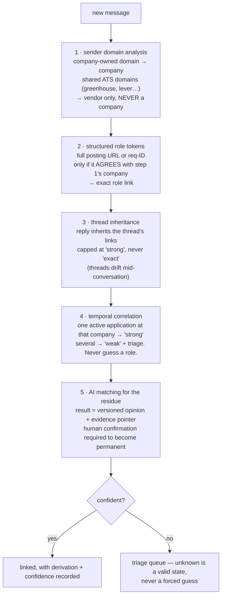

# 04 — download-emails: raw email capture, categorization, and pipeline linkage

**Status:** accepted; implementation has not started. Owner sign-off was
2026-07-21, and the final email git-policy question was resolved on
2026-07-22.
Folder scope, cutover criterion (now dual), unrelated-mail retention,
at-rest posture, and attachments (metadata-only) are decided and folded in;
the email git policy tracks only content-free index headers and safe
annotations. Record:
[memory/decisions/raw-data-layer-decisions.md](../../../memory/decisions/raw-data-layer-decisions.md).
The scheduling extension is in
[the application-progress/calendar design](../application-progress-calendar/README.md).
Writing follows [docs/design/STYLE.md](../STYLE.md).

Builds on [the store core](01-store-core.md) and
[the provider contract](03-provider-interfaces.md).

---


## For the human reviewer

**Problem this solves.** Every mailbox review re-reads the same messages
through the mail API, re-classifies them with AI attention, and keeps
nothing: no durable record of which message was a rejection for which role,
which threads await replies, which messages were already triaged. And when
the matcher mislinks a message, there is no raw copy to re-match after the
fix.

**What it will look like.** A `download-emails` skill incrementally syncs
job-relevant mail into the store (raw provider payloads, append-only), and a
builder categorizes each message, links it company → application → role, and
maintains triage queues for unknowns. Reviews become local queries; AI
tokens go only to new messages; and a status change always re-checks the
actual message first.

On disk (all identifiers fictional/neutral — `acct-01`, `examplecorp`):

```
email/
├── raw/outlook/acct-01/2026/07/21/<fetch_id>/manifest.json → _blobs/…
├── state/acct-01/sync.json          # per-folder sync tokens (opaque)
│              └── runs.jsonl        # append-only sync log
├── derived/acct-01/
│   ├── messages/2026-07/<message_key>/message.yaml
│   ├── threads/<thread_key>/thread.yaml
│   └── companies/<company>/inbox.yaml
├── index/acct-01/
│   ├── messages.jsonl               # one line per message — filter with code
│   ├── by-application/<slug>.jsonl  # reverse index: application → its messages
│   └── triage/{unresolved,needs-reply,deadlines}.jsonl
└── annotations/                     # HUMAN judgments only; quoted evidence
                                     #   lives in a git-ignored sidecar
```

**Pros:** mailbox reviews become local delta queries; categorization and
matching bugs are re-runnable retroactively; durable evidence links between
messages, applications, and postings; unknowns become a workflow instead of
a silent drop.

**Cons / costs:** full email bodies on local disk — the most sensitive data
this toolkit will hold, including *other people's* information the leak
guard cannot screen ([Privacy](#6-privacy) states this honestly); genuinely
fiddly sync machinery; the association logic needs its guard rails or it
*creates* the wrong-status-change failure it exists to prevent.

**Recommendation:** accepted with the guard rails below. The jobs store
has proved the pattern, every privacy decision is resolved, and the email
track can proceed in focused stages. With the provider contract's Gmail rules, a Gmail account
participates read-only from day one — full value for this skill, no
send-capable token.

---


## 1. Sync design

Written against Microsoft Graph's documented behavior; Gmail's model fails
the same ways, so the rules are provider-neutral:

- **Delta sync is per-folder**, with per-account, per-folder opaque tokens
stored in the `state/` zone — *not* under `raw/`, whose cleanup sweep
would eat them (a first-draft bug the adversarial review caught).
- **Full resync is a routine path, built first.** Microsoft expires delta
tokens unpredictably; Google expires history IDs within days. Delta sync
is the optimization, not the foundation. **Every full resync ends with an
inventory diff:** store entities absent from the mailbox are tombstoned —
otherwise messages deleted while a token was dead would haunt the queues
forever.
- **Deletions and moves have explicit semantics.** In-scope→in-scope move:
update the folder field. In-scope→out-of-scope move (e.g. you archive a
handled thread): keep the entity, mark it out-of-scope — raw is truth and
evidence links must survive. Provider hard-delete: tombstone. Queues
exclude tombstoned and out-of-scope messages automatically.
- **Ingestion is idempotent upsert** on the message key (next section):
delta responses replay messages, guarantee no ordering, and report a
folder move as delete-here + create-there.
- **The field list is versioned.** The set of fields requested from the API
is baked into the first delta request (the API encodes it into the sync
token), so changing it is a planned full resync, never a quiet edit.
- **Raw is the provider JSON actually received.** Full MIME export is an
optional per-thread enrichment, never used for identity (Microsoft
regenerates MIME non-deterministically). **Attachment content is never captured** (owner
decision, 2026-07-21) — offer letters and other candidates' resumes are
exactly what shouldn't land on disk silently. What IS captured:
**attachment metadata** in the message envelope (filename, size, content
type, and the provider's attachment ID as a retrieval pointer), so the
store can say "this message carried `offer_letter.pdf`, 210 KB" and a
human fetches it manually in the mail client when needed.
- **Scope is job-relevant capture, not mailbox archival:** Inbox + Sent +
Drafts per account (Sent is required to compute reply-state), folder list
configurable (decided: Inbox + Sent + Drafts — see
[Decisions](#10-decisions--five-resolved-one-open)). Within that scope,
**everything synced keeps its raw regardless of category** — mail
classified `unrelated` is retained like the rest (owner decision,
2026-07-21); retention is governed only by the GC config, never by
category.


### 1a. The staleness tripwire

A silently wedged sync must not turn "nothing new" into a missed interview
invite with a 48-hour window. The first draft had no defense; this one
does: every review **opens with one cheap live probe per synced folder**
(latest message time / item count) compared against the store's watermark.
Divergence beyond a threshold produces a hard **"STORE STALE — sync
broken"** banner, and the review refuses to present itself as complete. One
API call per folder preserves essentially all of the token win. The
gardener additionally flags gaps in the sync log and suspicious streaks of
zero-new-messages runs.

## 2. Message identity

The first draft keyed messages on the RFC Message-ID header, and the
adversarial review broke it three ways: drafts have no Message-ID until
sent (all drafts collapse into one entity); some bulk ATS mailers *reuse*
Message-IDs across distinct notifications (sender-controlled collisions —
and a human-verified annotation would silently re-attach to a different
message than the one verified); and Message-IDs can change at send time
(permanent ghost-draft entities).

**The fix:** `message_key = hash(account slug + provider's immutable message ID)`. Provider IDs are total (every item has one), collision-free,
and move-stable (Microsoft's immutable-ID option is requested explicitly;
Gmail message IDs are immutable). The RFC Message-ID is demoted to a
**correlation alias** — used to notice the same real-world message across
accounts, never as the key. Consequences:

- The same message CC'd to two of your accounts = two store entities
(correct — two mailbox items) correlated by alias.
- Annotations record the provider ID they were verified against and are
**loudly ignored on mismatch** (queued for human review), never silently
re-attached.
- Thread identity: the provider's thread ID within an account;
**cross-account thread correlation uses the RFC References/In-Reply-To
chain** — the only correlator that exists across providers.


## 3. Categorization and association

**Categories** come from a versioned public vocabulary file (receipt,
assessment, interview invite, scheduling, neutral status update, rejection,
offer, inbound recruiter outreach, outbound cold outreach, follow-up
needed, job-alert digest, background check/onboarding, unrelated, unknown —
non-exclusive flags coexist alongside). Scheduling carries structured
subtypes for booking requested, availability/booking submitted, schedule
confirmed, reschedule requested, replacement confirmed, and cancellation;
their guarded tracker/calendar effects are defined in
[the progress and calendar design](../application-progress-calendar/README.md#4-email-evidence-mapping).

**Who classifies:** deterministic rules first, recorded as versioned
machine opinions; AI only for what rules can't resolve — and per
[the store core's opinions-are-not-judgments rule](01-store-core.md#1-zones-and-their-contracts),
**an AI verdict is also just an opinion** inside the rebuild blast radius.
Only a human confirmation promotes a link or category to the annotations
zone. (First draft made AI verdicts immortal; a wrong link would have
survived every future rules improvement.)

**The association ladder**, with the guard rails the adversarial review
demanded:




Same picture, plain text:

```
new message
    │
 1. sender domain      company-owned domain → company
    │                  shared ATS domain (greenhouse, lever, workday, …)
    │                  → identifies the VENDOR only, never a company
    ▼
 2. structured role    full posting URL or req-ID — counts only if it AGREES
    tokens             with step 1's company → exact role link
    ▼
 3. thread             a reply inherits the thread's links — capped at
    inheritance        "strong", never "exact" (threads drift mid-conversation)
    ▼
 4. temporal           one active application at that company → "strong";
    correlation        several → "weak" + triage; never guess a role
    ▼
 5. AI (residue only)  verdict = versioned opinion + evidence pointer;
    │                  human confirmation required to become permanent
    ▼
confident? ── yes ──▶  linked (derivation + confidence recorded)
    └─────── no ────▶  triage queue (unknown is a valid state,
                       never a forced guess)
```

*Takeaway: every link records HOW it was derived and how confident it is —
because the status-change rules below treat those differently.*

Two rules deserve their own lines:

- **Shared ATS domains are a hardcoded denylist.** Mail from
greenhouse/lever/ashby/workday/icims/smartrecruiters notification domains
identifies the *vendor*, never the company — every customer of those
vendors mails from the same domains. The company registry's new
per-company email-domains field **refuses these domains at write time**,
so one careless triage resolution can never poison company matching
globally (the "mislink factory" the adversarial review demonstrated).
- **Bare numbers are not evidence.** A requisition-ID match counts only
when it agrees with the sender-derived company (requisition numbers
repeat across companies) and has structure (a full posting URL or a
prefixed requisition pattern — a bare number could be a zip code or a
ticket ID).


### 3b. The cross-store join

The jobs side writes the posting's store key into each application's
`meta.yaml` (see
[the job-postings integration](02-job-postings-pipeline.md#6-pipeline-integration));
the email side maintains the reverse index
`index/<account>/by-application/<slug>.jsonl`. So "show me every message
about this application" — the question you'll ask under stress, right after
a rejection lands — is one file read, not a grep across the whole message
index. Application slugs join applications↔messages; posting store keys
join messages↔postings.
When scheduling reconciliation lands, `jobs[].progress.calendar_item`
adds the role↔calendar link without duplicating exact times in
`meta.yaml`.

## 4. Reply-state and queues

"Replied" / "needs reply" are **computed projections** from mailbox facts —
is there a later Sent message in the correlated thread? — rebuilt by the
builder, never manually-stored flags that can go stale. Multi-account
correctness (a first-draft hole): reply-state evaluates across **all
mounted accounts** holding the thread, so a reply sent from your personal
Gmail clears the Outlook copy's needs-reply.

Two live checks deliberately survive store-first reading:

- the [staleness tripwire](#1a-the-staleness-tripwire) before any review,
and
- the pre-draft duplicate-reply preflight, run against **every account
holding the thread** — the store remembers; the live provider vouches for
*now*. Same philosophy as the jobs rule that acting on a posting requires
a fresh JD fetch.

Queues (`unresolved`, `needs-reply`, `deadlines`) are filtered projections
of the index; the gardener reports their ages; nothing ever auto-acts.

### 4a. Status transitions re-verify — the read-the-exact-message gate survives

The adversarial review's sharpest end-to-end attack on the first draft: a
thread starts about company A's role (linked "exact" via requisition ID) →
the recruiter pivots mid-thread to company B's opening → weeks later "we've
decided not to move forward" arrives in-thread → thread inheritance labels
it a rejection *of A* → store-fed reconciliation moves your **live**
application A to rejected. You stop following up on a real interview.
"Only the application-tracker writes statuses" did not prevent this — the
tracker writes whatever evidence it's handed.

The fix is contractual, not aspirational:

1. **Every status transition re-opens the stored message body** — a local
  read, near-zero tokens (this is precisely what a local store makes
   cheap) — and re-verifies the link and its scope at transition time.
   Today's "read the exact message; require one unambiguous match" gate
   survives store-first reading intact.
2. **Link derivation gates what can auto-flow.** Links derived by thread
  inheritance, temporal correlation, or unconfirmed AI **never** auto-feed
   a rejection or offer transition — those route to triage for a
   read-and-confirm step. Only direct-rule derivations (company-agreeing
   structured tokens) or human-confirmed links qualify, and the existing
   per-role vs whole-application scope rules apply unchanged.
3. The recorded transition names the message, the derivation, and the
  verified quote — auditable end to end.


## 5. Unknown handling and triage

Unknowns never block sync and are never guessed. A message the ladder can't
resolve lands in the unresolved queue with whatever partial links it has.
Triage is a workflow: unresolved messages batch by sender domain (most
unknowns are one new domain × N messages); you or an agent resolves the
batch once; the resolution becomes an annotation, and — when it's a
reusable fact like "this domain belongs to this company", and the domain is
not on the shared-ATS denylist — a registry addition, so that class of
unknown never recurs. After rules improve, a links-only rebuild re-runs the
ladder over everything; human annotations win, and any disagreement queues
for review rather than being silently overridden. Messages that stay
unknown forever are fine: synced, findable, costing nothing.

## 6. Privacy

Stated honestly, because the first draft wasn't:

- **Third-party information is a class the leak guard cannot screen.** The
guard detects *your* identity tokens. The email store holds recruiter
names and phone numbers, other candidates in forwarded threads,
company-confidential process details. Structural patterns (raw email
addresses, phone numbers) are catchable; names and confidential prose are
not. Protection is therefore structural: bodies never in tracked or
public files; evidence quotes minimal and confined to a git-ignored
sidecar; the
[store-wide egress rules](01-store-core.md#11-content-egress) cover
triage tables and query output; capture scope stays narrow.
- **Quoted evidence lives in a git-ignored sidecar.** Tracked annotations
carry only content hashes/offsets plus a short paraphrase. (The first
draft simultaneously required "quoted evidence in annotations" and
promised "no bodies in tracked files" — a direct contradiction.)
- **Git policy for email is stricter than for jobs.** The owner chose to
track only content-free index headers and safe annotations. Raw, derived,
message index rows, and the evidence sidecar stay out of git because even
subjects routinely carry third-party names. See
[the decision record](../../../memory/decisions/email-git-policy.md).
- **At-rest (decided 2026-07-21):** documented assumption — this runs on
private machines and **the user is responsible for protecting the raw
data**; no encryption tooling is built. (The owner asked what encryption
would even add: exactly one scenario — device loss/theft — and macOS
FileVault, on by default on modern Macs, already covers it. The question
existed to make that assumption explicit rather than silent; it now is.)
- **Reading a body is always a deliberate act:** query output and triage
tables carry envelope fields and categories, never bodies; a body enters
AI context only via an explicit per-message read command, which also
serves the human investigating "why was this categorized wrong?" (the
store-side equivalent of today's read-one-message command — the first
draft promised the rule but omitted the command).
- **Draft-only is unchanged and structurally stronger** — enforced in
[the provider contract](03-provider-interfaces.md#2-the-safety-architecture--three-layers-strongest-first),
below every consumer.


## 7. Cutover: proving the store before trusting it

The old mailbox-reading flow and the new store-first flow run side by side
before any cutover — but comparably, which the first draft got wrong (it
compared a 50-message live window against full-history store queues; the
resulting wall of expected mismatches would bury the one real signal, a
wedged sync). The comparison runs on the **intersection**: same folders,
same date range, same message set by key; per-message verdicts only. Pass requires
BOTH (owner decision, 2026-07-21): **five consecutive comparison runs with
zero verdict mismatches** AND **at least 300 job-related messages processed
through both paths** — the volume floor keeps a quiet mailbox week from
green-lighting an under-tested store. The staleness tripwire runs from day
one of the trial. Cutover is your call on that evidence.

## 8. Alternatives considered


| Alternative                                                 | Why rejected                                                                                                                                                                   |
| ----------------------------------------------------------- | ------------------------------------------------------------------------------------------------------------------------------------------------------------------------------ |
| Keep reading the mailbox live every review (status quo)     | Re-pays fetch + AI classification forever; no bug recovery; no durable evidence links.                                                                                         |
| Whole-mailbox archival                                      | Maximizes the privacy surface for data the toolkit never uses; narrow scope + easy widening later is strictly safer.                                                           |
| Store derived metadata only, no raw bodies                  | Matcher and categorizer bugs become unfixable retroactively, and the transition-time re-verification (the design's key safety rule) *requires* local bodies.                   |
| Key messages on the RFC Message-ID                          | Broken three ways in review — see [Message identity](#2-message-identity).                                                                                                     |
| Categories as folder hierarchy (a rejections/ folder, etc.) | A message has one folder but many facets (category, flags, links, confidence); facets belong in metadata.                                                                      |
| Auto-apply status transitions from categories               | Crosses the evidence→action line; the [transition rules](#4a-status-transitions-re-verify--the-read-the-exact-message-gate-survives) make the gate explicit and cheap instead. |


## 9. What the reviews changed


| What the review found (lens, severity)                                                                                                                                                                                                                            | How this design now handles it                                                                                                                                                                                         |
| ----------------------------------------------------------------------------------------------------------------------------------------------------------------------------------------------------------------------------------------------------------------- | ---------------------------------------------------------------------------------------------------------------------------------------------------------------------------------------------------------------------- |
| Store-fed reconciliation deleted today's "read the exact message before changing status" gate; thread-inherited links could confidently reject the wrong live application. (adversarial-email; blocker)                                                           | Derivation-aware links + mandatory transition-time re-verification — [Association](#3-categorization-and-association), [Transition rules](#4a-status-transitions-re-verify--the-read-the-exact-message-gate-survives). |
| Keying on the RFC Message-ID collapses drafts, lets senders force collisions, and re-attaches verified annotations to the wrong message. (adversarial-email; blocker)                                                                                             | Provider-immutable-ID keys; Message-ID demoted to correlation alias; annotations verify their target — [Message identity](#2-message-identity).                                                                        |
| Shared ATS notification domains written into the company registry would deterministically mislink every future customer of that vendor. (adversarial-email; major)                                                                                                | Hardcoded vendor-domain denylist enforced at registry-write time — [Association](#3-categorization-and-association).                                                                                                   |
| Requisition-ID matching without a company gate produces confident wrong-role links (IDs repeat across companies). (adversarial-email; major)                                                                                                                      | Company-agreement + structured-token requirements — [Association](#3-categorization-and-association).                                                                                                                  |
| Wrong AI verdicts stored as annotations became immortal — protected from every future rules fix. (adversarial-email; major)                                                                                                                                       | AI verdicts are rebuildable opinions; human confirmation promotes; conflicts queue — [Association](#3-categorization-and-association) and [the store core](01-store-core.md#1-zones-and-their-contracts).              |
| Account partitioning was promised but only raw was partitioned; cross-account reply-state would compute wrongly and draft duplicates. (adversarial-email; major)                                                                                                  | Every zone account-partitioned; References-chain thread correlation; all-accounts preflight — [Message identity](#2-message-identity), [Reply-state](#4-reply-state-and-queues).                                       |
| No staleness detection: a wedged sync silently reports "nothing new" while an interview invite ages in the real inbox. (adversarial-email; major)                                                                                                                 | The staleness tripwire + gardener checks — [Sync design](#1a-the-staleness-tripwire).                                                                                                                                  |
| Mutable sync state under `raw/` would be garbage-collected by the store's cleanup sweep. (adversarial-email; major)                                                                                                                                               | Sync state lives in the `state/` zone — [Sync design](#1-sync-design).                                                                                                                                                 |
| Deletion semantics were unspecified: archived/deleted messages would haunt queues forever, especially across full resyncs. (adversarial-email; major)                                                                                                             | Explicit move/delete semantics + resync inventory diff — [Sync design](#1-sync-design).                                                                                                                                |
| Tracked annotations required quoted evidence while the privacy section promised no bodies in tracked files — a direct contradiction; and tracking derived subjects pushed third-party PII into git history. (adversarial-email + human-ergonomics/privacy; major) | Evidence sidecar (git-ignored); git-policy recommendation flipped — [Privacy](#6-privacy) and [the decision record](../../../memory/decisions/email-git-policy.md).                                                |
| The side-by-side trial compared incomparable windows — noise would bury real failures. (adversarial-email; minor)                                                                                                                                                 | Intersection-based comparison with an explicit pass criterion — [Cutover](#7-cutover-proving-the-store-before-trusting-it).                                                                                            |
| Third-party PII unacknowledged; attachments policy missing; no at-rest consideration; no command to read a stored body. (human-ergonomics/privacy; major/minor)                                                                                                   | [Privacy](#6-privacy) first bullet; attachment-metadata rule in [Sync design](#1-sync-design); the at-rest assumption in [Privacy](#6-privacy); the explicit read-stored command.                                                                   |
| No reverse path from an application to its messages — the highest-stress investigation required a full-index grep. (human-ergonomics; major)                                                                                                                      | The by-application reverse index — [Cross-store join](#3b-the-cross-store-join).                                                                                                                                       |


## 10. Decisions — all resolved

Five decisions were answered by the owner on 2026-07-21, and the email git
policy was answered on 2026-07-22. The records are
[the raw-data-layer sign-off](../../../memory/decisions/raw-data-layer-decisions.md)
and [the email git-policy follow-up](../../../memory/decisions/email-git-policy.md).

| Decision | Owner's answer | Where it landed in this doc |
| --- | --- | --- |
| Which folders does sync cover? | Inbox + Sent + Drafts | [Sync design](#1-sync-design) |
| Cutover criterion for store-first reviews | **Both** required: 5 consecutive zero-mismatch comparison runs AND ≥300 job-related messages processed through both paths | [Cutover](#7-cutover-proving-the-store-before-trusting-it) |
| Keep raw payloads of messages classified "unrelated"? | Keep | The category-never-drives-retention rule in [Sync design](#1-sync-design) |
| At-rest encryption posture | Private-machines assumption; user is responsible for protecting raw data; no encryption tooling (owner's "what's the point?" question answered inline) | [Privacy](#6-privacy) |
| Capture email attachments? | Content: never. **Metadata: yes** — filename, size, content type, provider attachment ID | [Sync design](#1-sync-design) |
| Email git policy | Track only content-free index headers and safe annotations; keep raw, derived, message rows, and quoted evidence out of git | [Decision record](../../../memory/decisions/email-git-policy.md) and [Privacy](#6-privacy) |

## 11. Human questions / additional tasks

*Owner space — anything written here is picked up by the next agent session
(see the async-collaboration contract in `AGENTS.md`). Questions get
answered in place; tasks get filed into `message-queue/` and linked back here.*

- (none right now)
