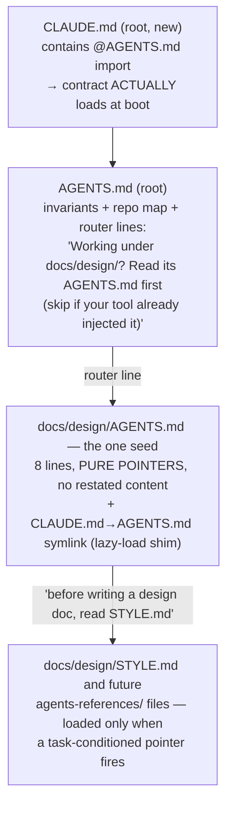

# Tree-scoped instructions: per-folder AGENTS.md loaded only on entry

**Status:** core mechanism implemented in PR #48; validator/exporter
hardening remains queued. Designed, adversarially reviewed, and revised
(2026-07-21). The
review empirically confirmed the core mechanism in a live session (the
folder shim really does lazy-load) and overturned four v1 mistakes, all
fixed below and listed in [What the review changed](#6-what-the-review-changed).
The owner chose reactive leaf growth on 2026-07-22. Writing follows
[docs/design/STYLE.md](../STYLE.md).

---

## For the human reviewer

**Problem this solves.** Every instruction an agent needs currently rides
in the always-loaded stack, and the measured "instruction boot tax" was
~22% of a multi-agent run's tokens. Folder-specific knowledge either bloats
the root contract or doesn't exist. The fix is three loading tiers: root
(always), per-folder leaf (only when working in that folder), references
(only when a specific task triggers them).

**The review's most important finding:** the repo had **no root**
`CLAUDE.md` — Claude Code auto-loads `CLAUDE.md`, not `AGENTS.md`, so the
agent contract was never auto-injected at boot; agents only saw it if
something told them to read it. That pre-existing gap is now closed with a
root `CLAUDE.md` containing an `@AGENTS.md` import (loads at launch —
exactly right for the root tier, and survives Windows checkouts).

**What it looks like:**




Same picture, plain text:

```
CLAUDE.md (root, NEW)  =  "@AGENTS.md"  → the contract actually loads at boot
    │
AGENTS.md (root) — invariants + repo map + router lines, e.g.:
    │   "Working under docs/design/? Read docs/design/AGENTS.md first
    │    (skip if your tool already injected it)."
    ▼   loaded lazily — only when an agent works in that folder
docs/design/AGENTS.md — THE one seed leaf: 8 lines of pure pointers
    │   (+ sibling CLAUDE.md → AGENTS.md symlink, the lazy-load shim
    │    that a live session confirmed fires on first read there)
    ▼   loaded only when the pointed-at task actually comes up
docs/design/STYLE.md / future agents-references/ files
```

*Takeaway: three tiers — boot, folder-entry, task — and a leaf may only
ever contain pointers or lines RELOCATED out of always-loaded files, so the
tree can only shrink total context, never grow it.*

**Pros:** the boot tax stops growing with the repo; folder knowledge lives
next to the folder; native lazy-load in both tools actually used here
(empirically verified for Claude Code; documented for Cursor); router lines
keep it working in tools with no auto-loading.

**Cons / costs:** the additive-only and relocation rules are conventions a
validator must back (task filed, spec corrected per review); nested
instructions are advisory everywhere — hard invariants stay in root +
hooks; exported public copies need symlink/absent-folder handling (in the
validator task); Windows checkouts materialize symlinks as junk text files
(documented limitation; the root shim deliberately uses an import file
instead).

**Recommendation:** adopted as revised. One seed leaf ships
(`docs/design/`); the todo/ leaf from v1 was **deleted** after review
showed it was 100% restatement of always-loaded content with one
self-contradictory clause — the queue contract lives in root, which every
session loads anyway.

---


## 1. The three tiers


| Tier       | File                                                                                                      | Loaded                                                                                                   | Budget                                   | May contain                                                                 |
| ---------- | --------------------------------------------------------------------------------------------------------- | -------------------------------------------------------------------------------------------------------- | ---------------------------------------- | --------------------------------------------------------------------------- |
| Root       | `AGENTS.md`, injected via the root `CLAUDE.md` import shim                                                | At boot                                                                                                  | ≤500 lines (existing)                    | Hard invariants, repo map, conventions, router lines                        |
| Leaf       | `<folder>/AGENTS.md` + sibling `CLAUDE.md` symlink                                                        | On first read in that folder (Claude Code), on working there (Cursor), via router line (everything else) | ≤100 lines AND ≤4 KiB; target well under | **Pointers, and lines relocated out of always-loaded files. Nothing else.** |
| References | `<folder>/agents-references/*.md` (and `docs/design/STYLE.md`, grandfathered as this tier for its folder) | Only via a task-conditioned pointer                                                                      | ≤300 lines per file                      | Unbounded detail                                                            |


Four rules, each defusing a failure mode the review demonstrated:

- **Relocation-or-pointer only.** A leaf ships only content *removed from*
an always-loaded file in the same change, or pure pointers — reviewed as
a net-zero-or-negative context diff. (v1's seeds were duplicates, which
made every session strictly more expensive; one seed was deleted for it.)
- **Additive-only, root wins.** A leaf never restates or contradicts the
root; a conflict is a bug in the leaf. This is *our* declared precedence
because the ecosystem has none (the AGENTS.md spec leaves nested
precedence formally open; tools just concatenate).
- **Task-conditioned pointers.** References are reached only through
"before/when task, read file" lines. Plain import syntax is
banned for lazy content — in Claude Code, imports load at launch.
- **Hard invariants never live in leaves.** Advisory files can't carry
leak-guard-class rules; those stay in root + hooks.

Paths inside leaves are written **repo-root-relative** (except same-folder
links), so the validator can check existence without heuristics.

## 2. Loading reality per tool


| Tool                          | What actually happens                                                                                                                                                                                                                                                | Our handling                                                                                                                                                                                    |
| ----------------------------- | -------------------------------------------------------------------------------------------------------------------------------------------------------------------------------------------------------------------------------------------------------------------- | ----------------------------------------------------------------------------------------------------------------------------------------------------------------------------------------------- |
| Claude Code (primary)         | Auto-loads `CLAUDE.md` only. Root: **was never loading** — fixed by the root import shim. Nested: lazy-loads on first file-read in the folder (**empirically confirmed** in the review session); NOT re-injected after context compaction until the next read there. | Root `CLAUDE.md` with `@AGENTS.md`; leaf `CLAUDE.md → AGENTS.md` symlinks; a compaction rule in the router section ("after compaction, re-read the leaf of any routed folder you're still in"). |
| Cursor (secondary)            | Nested `AGENTS.md` applied natively when working in that folder.                                                                                                                                                                                                     | Nothing needed.                                                                                                                                                                                 |
| Root-only tools (Codex-class) | Load the root→cwd chain at session start; never scan below cwd; silently truncate the concatenated AGENTS.md chain at 32 KiB.                                                                                                                                        | Router lines are the fallback; the 32 KiB budget applies to the **AGENTS.md chain only** (pointer targets are agent-initiated reads and never count — v1 measured this wrong).                  |
| Windows public checkouts      | Tracked symlinks materialize as junk one-line text files.                                                                                                                                                                                                            | Documented limitation of leaf shims (same as the existing `.claude/skills` idiom); the root shim is a real file precisely to avoid this for the contract itself.                                |


## 3. Router lines (root-side anchor)

The root `AGENTS.md` "Folder-Scoped Context" section carries one
machine-parseable, imperative line per leaf:

```
Working under `docs/design/`? Read `docs/design/AGENTS.md` first (skip if your tool already injected it).
```

The "skip if already injected" clause prevents the double-load the v1
wording forced on Claude Code (explicit Read + auto-injection of the same
content through the symlink, which the read-hygiene rule forbids). The
router doubles as the validator's registry of leaves and as the
instruction-budget script's discovery source.

## 4. Growth policy: reactive, one seed

Create a leaf only after the second folder-local correction, or on
explicit owner ask; propose via `todo/decisions/` when unsure. Current
tree: **one** leaf — `docs/design/` (pure pointers to its binding style
contract). The v1 `todo/` leaf was deleted: its folder's contract is needed
at *boot and write time*, which read-triggered lazy-loading structurally
misses, and it's already in the always-loaded root. Skills never get
leaves — `SKILL.md` is the progressive-disclosure mechanism for *tasks*;
the tree covers *folders*; the two must not double-instruct.

## 5. Validation and export

The corrected validator spec lives in
`todo/tasks/tree-instructions-validator.md`: repo-root-relative path
existence; ≥1 pointer per reference file (v1's "exactly one" was the wrong
cardinality); shim + router-line presence with absent-folder skip (public
exports omit `todo/`, and routed-but-absent must not fail public CI); leaf
and AGENTS.md-chain budgets; broken-symlink hard-fail (the leak guard
currently fails open on those); exporter regeneration of leaf shims (the
exporter follows symlinks today, which would ship a duplicated regular
file — a drift bomb); and gardener stale-leaf reporting by commit-churn
ratio with a whitelist.

## 6. What the review changed

An adversarial review ran against v1 with access to a live Claude Code
session and the repo's actual tooling. In plain language:


| What the review found (severity)                                                                                                                                                                                                             | How v2 handles it                                                                                                                                  |
| -------------------------------------------------------------------------------------------------------------------------------------------------------------------------------------------------------------------------------------------- | -------------------------------------------------------------------------------------------------------------------------------------------------- |
| The router lived in a file the primary tool never auto-loads: no root `CLAUDE.md` existed, and the session proved root `AGENTS.md` was not injected at boot. (blocker)                                                                       | Root `CLAUDE.md` with an `@AGENTS.md` import — [the review's most important finding](#for-the-human-reviewer).                                     |
| The `todo/` leaf was ~100% restatement of always-loaded content, contained one clause conflicting with the root contract, and its lazy-load trigger (file reads) structurally misses the write-time filing work it governed. (major)         | Leaf deleted, symlink deleted; queue contract stays in root — [Growth policy](#4-growth-policy-reactive-one-seed).                                 |
| The `docs/design/` leaf inlined compressed copies of the style contract instead of pointing at it — the exact drift vector the design warns about. (major)                                                                                   | Stripped to 8 lines of pure pointers; the relocation-or-pointer rule added — [The three tiers](#1-the-three-tiers).                                |
| Net token effect of v1 was negative: everything added, nothing removed. (major)                                                                                                                                                              | The relocation rule makes leaves net-zero-or-negative by construction.                                                                             |
| The validator spec was unimplementable and already failing on the tree it claimed green (path-resolution base undefined, wrong pointer cardinality, chain budget counting files that never auto-load, unobservable gardener metric). (major) | Full respec in the validator task — [Validation and export](#5-validation-and-export).                                                             |
| The instruction-budget script can't express leaf budgets without a schema change (filename-keyed budgets, no bytes dimension, fixed glob list). (major)                                                                                      | Honestly scoped in the validator task: role+path-keyed budgets, bytes column, router-driven discovery.                                             |
| The exporter follows symlinks (shipping a duplicated `CLAUDE.md` file into the public repo) and ships a router pointing at `todo/`, which exports omit; the leak guard fails open on broken symlinks. (major)                                | Exporter shim-regeneration + absent-folder gating + fail-closed symlink check, all in the validator task; router/ritual lines are existence-gated. |
| Compaction loss and stale leaves were named as risks but not mitigated. (major)                                                                                                                                                              | Compaction re-read rule in the router section; churn-ratio gardener report in the validator task.                                                  |
| Style violations in the design's own docs (a banned bare section pointer, an invented decision-ID family, drifted diagram twins). (minor)                                                                                                    | Fixed; the growth-policy decision was recorded through the sanctioned Q-family.                                                                    |
| Windows checkouts turn symlinks into junk text files, silently. (minor)                                                                                                                                                                      | Documented; root shim is a real file for exactly this reason — [Loading reality](#2-loading-reality-per-tool).                                     |


## 7. Decision (resolved)

| Decision | Owner's answer | Record |
| --- | --- | --- |
| When should new folder-scoped instruction leaves be created? | Reactively: after the second folder-local correction or an explicit owner request; use `todo/decisions/` when unsure, and require relocation-or-pointer-only content | [Tree-instruction growth policy](../../../design-decisions/tree-instruction-growth-policy.md) |

## Research notes (provenance)

Grounded in a July-2026 research pass (tool docs + field practice): the
AGENTS.md open spec blesses nesting but leaves precedence formally
undefined; Claude Code documentation (CLAUDE.md-only discovery, the
import/symlink bridges, nested lazy-load on file-read, imports load at
launch, ~200-line-per-file guidance, no re-injection after compaction);
Cursor's native nested-AGENTS.md support; Codex-class root→cwd loading
with 32 KiB silent truncation; field guidance on root-as-router with
externalized detail and reactive growth; a measured finding that a good
instruction file cut task tokens ~17% while bloated ones *raised* costs
~23%; and context-linter tooling whose path-existence and freshness checks
the validator task adapts. The adversarial review added two empirical data
points from a live session: leaf symlink shims do trigger Claude Code's
lazy injection, and root `AGENTS.md` (without a shim) was never loaded.

## 8. Human questions / additional tasks

*Owner space — anything written here is picked up by the next agent session
(see the async-collaboration contract in `AGENTS.md`). Questions get
answered in place; tasks get filed into `todo/` and linked back here.*

- (none right now)
